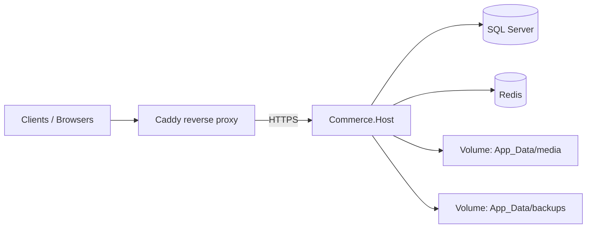

# Commerce — Production Deployment Guide

This guide describes how to deploy the Commerce Framework host with Docker, SQL Server, Redis, HTTPS reverse proxy, and persistent storage.

## Architecture



| Component | Role |
|-----------|------|
| **Caddy** | TLS termination, HTTP→HTTPS redirect, reverse proxy, gzip |
| **Commerce.Host** | API, installation, modules, plugins, background jobs |
| **SQL Server** | Primary relational data store |
| **Redis** | Distributed cache and locks (staging/production) |
| **App_Data volumes** | Media files, digital downloads (via media storage), local backups |

Storefront and admin Angular apps are deployed separately (static hosting or CDN) and call the API via CORS / same-origin BFF. See [ENVIRONMENT-CONFIGURATION.md](./ENVIRONMENT-CONFIGURATION.md).

## Environments

| Environment | Compose files | TLS | Cache | Migrations on startup |
|-------------|---------------|-----|-------|------------------------|
| **Development** | `docker-compose.yml` | No (port 8080) | Redis | No — use installation wizard |
| **Staging** | `docker-compose.yml` + `docker-compose.staging.yml` | Caddy (Let's Encrypt or internal) | Redis | Yes |
| **Production** | `docker-compose.yml` + `docker-compose.production.yml` | Caddy + ACME | Redis | Yes |

Files live under [`deploy/docker/`](../../deploy/docker/).

## Quick start (development)

```bash
cd deploy/docker
cp .env.example .env
# Edit .env — set MSSQL_SA_PASSWORD (dev-only value)

docker compose --env-file .env up -d --build
```

- API: `http://localhost:8080`
- Installation: `http://localhost:8080/installation`
- Health: `http://localhost:8080/health/ready`

### Automated clean install test

From repository root:

```powershell
.\scripts\deploy\test-clean-install.ps1
```

```bash
./scripts/deploy/test-clean-install.sh
```

This destroys volumes, rebuilds, runs the full installation API flow, and verifies `/health/ready`.

## Staging deployment

1. Copy `deploy/docker/.env.example` to `.env` (never commit `.env`).
2. Set:
   - `MSSQL_SA_PASSWORD` — strong password
   - `COMMERCE_DOMAIN` — staging hostname (DNS → server)
   - `CADDY_EMAIL` — ACME registration email
   - `COMMERCE_BASE_URL=https://<domain>`
3. Deploy:

```bash
docker compose -f docker-compose.yml -f docker-compose.staging.yml --env-file .env up -d --build
```

4. Complete installation at `https://<domain>/installation` (or run bootstrap script against staging URL).
5. Confirm `/health/ready` is **Healthy**.

## Production deployment

1. Provision a Linux VM or container host with Docker Engine 24+ and Compose v2.
2. Create `.env` on the server from `.env.example`. **Do not store production secrets in git.**
3. Use a secrets manager (Azure Key Vault, AWS Secrets Manager, HashiCorp Vault) or orchestrator secrets for:
   - `MSSQL_SA_PASSWORD`
   - Admin bootstrap credentials (one-time install only)
   - Payment provider keys (configured post-install via admin settings)
4. Deploy:

```bash
docker compose -f docker-compose.yml -f docker-compose.production.yml --env-file .env up -d --build
```

5. Run installation once, then lock the installer (automatic on `POST /installation/complete`).
6. Configure monitoring on `/health/ready` and log aggregation (JSON console logs).

### Persistent data

| Path | Content | Backup |
|------|---------|--------|
| `commerce-app-data` volume → `/app/App_Data/media` | Product media, download files | Phase 43 DR module + volume snapshots |
| `commerce-app-data` → `/app/App_Data/backups` | Module-generated backups | Off-site copy |
| `commerce-sql-data` volume | Database files | SQL native backup + DR module |
| `caddy-data` volume | TLS certificates | ACME auto-renewal |

Mount custom plugin packages read-only in production when needed:

```yaml
volumes:
  - /secure/plugins:/app/Plugins:ro
```

## Database migration

| When | How |
|------|-----|
| **First install** | Installation wizard or bootstrap script → `POST /installation/migrate` |
| **Upgrades (staging/production)** | `Commerce:Deployment:ApplyMigrationsOnStartup=true` applies pending migrations on container start |
| **Manual** | `POST /installation/migrate` before install lock, or restart container after upgrade |

Startup migration runs only when commerce is **already installed**. Failed migrations fail fast (container exits).

## Health checks

| Probe | Endpoint | Use |
|-------|----------|-----|
| Liveness | `/health/live` | Container/process alive |
| Readiness | `/health/ready` | Load balancer traffic gate |
| Full | `/health` | Diagnostics |

Docker `HEALTHCHECK` and Caddy upstream health use `/health/live`. Route production traffic only when `/health/ready` is **Healthy**.

## Logging

Staging and production `appsettings.*.json` enable **JSON console** logging with UTC timestamps. Collect stdout/stderr from the `commerce` container with your log platform (CloudWatch, Loki, ELK, Application Insights).

Correlation headers: `X-Correlation-ID`, `X-Request-ID` — see [COMMERCE-OPERATIONS.md](./COMMERCE-OPERATIONS.md).

## Restart policies

| Service | Development | Staging | Production |
|---------|-------------|---------|------------|
| sqlserver | `unless-stopped` | `unless-stopped` | `always` |
| redis | `unless-stopped` | `unless-stopped` | `always` |
| commerce | `unless-stopped` | `unless-stopped` | `always` |
| caddy | — | `unless-stopped` | `always` |

## Rollback procedure

See [Rollback](#rollback) below and [DISASTER-RECOVERY.md](./DISASTER-RECOVERY.md) for full restore.

### Application rollback (last known-good release)

1. **Identify target version** — previous image tag or git commit SHA used for the last stable build.
2. **Stop traffic** — set load balancer to maintenance or scale Caddy/commerce to 0.
3. **Restore database** if the failed release applied migrations:
   - Restore SQL backup from before the upgrade **or**
   - Run down-migration scripts if your release notes provide them (module migrations are forward-only by default).
4. **Deploy previous image**:

```bash
docker compose -f docker-compose.yml -f docker-compose.production.yml --env-file .env up -d commerce
# with image pinned, e.g. commerce:2026.08.12-abc123
```

5. **Verify** `/health/ready`, smoke-test checkout, admin login.
6. **Re-enable traffic**.

### Configuration rollback

1. Revert environment variables / `.env` to previous values (keep secrets in vault history).
2. Restart commerce: `docker compose restart commerce`.
3. Confirm settings in admin UI match expected state.

### Forward fix vs rollback decision

| Situation | Action |
|-----------|--------|
| Bad config, DB unchanged | Config rollback + restart |
| Bad migration applied | DB restore from backup + previous image |
| Data corruption | Full DR restore per `DISASTER-RECOVERY.md` |

**Never claim a rollback succeeded without verifying `/health/ready` and a smoke test.**

## Secrets policy

- **Never** commit `.env`, TLS private keys, connection strings, or API keys.
- Repository contains only `.env.example` with placeholder values.
- Production secrets: server `.env`, Docker secrets, or CI/CD secret store.
- Configuration backups mask connection string passwords (Phase 43).

## Related documentation

- [ENVIRONMENT-CONFIGURATION.md](./ENVIRONMENT-CONFIGURATION.md) — variables and appsettings by environment
- [COMMERCE-OPERATIONS.md](./COMMERCE-OPERATIONS.md) — monitoring, correlation, health
- [DISASTER-RECOVERY.md](./DISASTER-RECOVERY.md) — backup, restore, RPO/RTO

## Phase reference

Implementation report: [PHASE-44-REPORT.md](./PHASE-44-REPORT.md)
