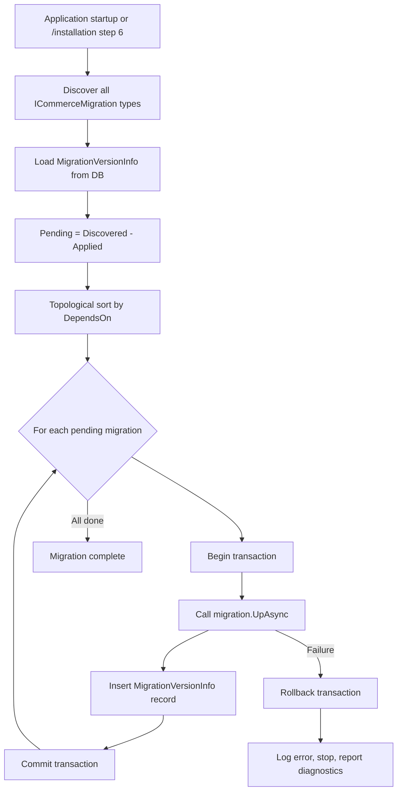

# Commerce Framework — Migration Plan (PHASE 0)

**Purpose:** Define the database migration engine, installation wizard database setup, and Smartstore data import strategy.

---

## 1. Migration Engine Overview

The commerce framework uses a custom migration engine inspired by Smartstore's `MigrationVersionInfo` pattern but implemented independently with EF Core.

### Design goals

| Goal | Approach |
|---|---|
| Track all migrations | `MigrationVersionInfo` table (compatible concept with Smartstore) |
| Support core, module, and plugin migrations | Scoped by `SystemName` |
| Dependency ordering | Topological sort on migration dependencies |
| Safe failure | Transaction boundaries; stop on first failure |
| Idempotent where appropriate | Check-before-create patterns |
| Diagnostics | Structured logging with migration name, duration, outcome |
| Repeatable | Re-run safe migrations without error |

---

## 2. Migration Contract

```csharp
public interface ICommerceMigration
{
    string SystemName { get; }       // "Core", "Catalog", "Payment.ZarinPal"
    string Version { get; }          // "1.0.0", "20260811120000"
    string Description { get; }
    IReadOnlyList<string> DependsOn { get; }  // Other migration versions

    Task UpAsync(CommerceDbContext context, CancellationToken ct);
    Task DownAsync(CommerceDbContext context, CancellationToken ct);
}
```

### Migration attribute

```csharp
[AttributeUsage(AttributeTargets.Class)]
public sealed class CommerceMigrationAttribute : Attribute
{
    public CommerceMigrationAttribute(string systemName, string version, string description)
    {
        SystemName = systemName;
        Version = version;
        Description = description;
    }

    public string SystemName { get; }
    public string Version { get; }
    public string Description { get; }
    public string[] DependsOn { get; set; } = [];
}
```

### Example

```csharp
[CommerceMigration("Core", "1.0.0", "Initial core platform tables")]
public class CoreInitialMigration : ICommerceMigration
{
    public string SystemName => "Core";
    public string Version => "1.0.0";
    public string Description => "Initial core platform tables";
    public IReadOnlyList<string> DependsOn => [];

    public async Task UpAsync(CommerceDbContext context, CancellationToken ct)
    {
        // Create Setting, Log, ScheduleTask, MigrationVersionInfo tables
    }

    public async Task DownAsync(CommerceDbContext context, CancellationToken ct)
    {
        // Drop core tables
    }
}
```

---

## 3. Migration Version Registry

### Database table (Smartstore-compatible concept)

```sql
CREATE TABLE MigrationVersionInfo (
    Id              INT IDENTITY(1,1) PRIMARY KEY,
    SystemName      NVARCHAR(400) NOT NULL,
    Version         NVARCHAR(50) NOT NULL,
    Description     NVARCHAR(500) NULL,
    AppliedOnUtc    DATETIME2 NOT NULL,
    CONSTRAINT UQ_MigrationVersionInfo_SystemName_Version UNIQUE (SystemName, Version)
);
```

This mirrors Smartstore's `MigrationVersionInfo` / `__MigrationVersionInfo` concept but uses our own schema management.

### Migration record entity

```csharp
public class MigrationRecord
{
    public int Id { get; set; }
    public string SystemName { get; set; } = null!;
    public string Version { get; set; } = null!;
    public string? Description { get; set; }
    public DateTime AppliedOnUtc { get; set; }
}
```

---

## 4. Migration Runner

```csharp
public interface IMigrationRunner
{
    Task<IReadOnlyList<MigrationInfo>> GetPendingMigrationsAsync(CancellationToken ct);
    Task<IReadOnlyList<MigrationInfo>> GetAppliedMigrationsAsync(CancellationToken ct);
    Task<MigrationResult> RunPendingMigrationsAsync(CancellationToken ct);
    Task<MigrationResult> RunMigrationAsync(string systemName, string version, CancellationToken ct);
}

public sealed class MigrationRunner : IMigrationRunner
{
    // 1. Discover all ICommerceMigration implementations (core + modules + plugins)
    // 2. Load applied migrations from MigrationVersionInfo
    // 3. Compute pending = discovered - applied
    // 4. Topological sort by DependsOn
    // 5. Execute each pending migration in order within transaction
    // 6. Record success in MigrationVersionInfo
    // 7. On failure: rollback transaction, log error, stop
}
```

### Execution flow



---

## 5. Migration Scopes

### 5.1 Core migrations (Phase 1-2)

| Migration | Version | Tables created |
|---|---|---|
| `CoreInitialMigration` | 1.0.0 | `MigrationVersionInfo`, `Setting`, `Log`, `ScheduleTask`, `ScheduleTaskHistory`, `GenericAttribute` |
| `CoreActivityLogMigration` | 1.0.1 | `ActivityLog`, `ActivityLogType` |
| `CoreInstallationMigration` | 1.0.2 | `InstallationState` (tracks install wizard progress) |

### 5.2 Module migrations (by phase)

| Module | Phase | Key tables |
|---|---|---|
| Stores | 4 | `Store`, `StoreMapping`, `Currency` |
| Localization | 4 | `Language`, `LocaleStringResource`, `LocalizedProperty` |
| Seo | 4 | `UrlRecord` |
| Catalog | 5 | `Product`, `Category`, `Manufacturer`, attributes, variants, mappings |
| Customers | 6 | `Customer`, `CustomerRole`, `Address`, mappings |
| ShoppingCart | 7 | `ShoppingCartItem`, `CheckoutAttribute`, `CheckoutAttributeValue` |
| Orders | 8 | `Order`, `OrderItem`, `OrderNote`, `Shipment`, `ReturnCase` |
| Payments | 9 | `GiftCard`, `WalletHistory` |
| Shipping | 10 | `ShippingMethod`, `ShippingByTotal`, `ShippingByWeight`, `DeliveryTime` |
| Tax | 10 | `TaxCategory`, `TaxRate`, `Country`, `StateProvince` |
| Discounts | 11 | `Discount`, `Rule`, `RuleSet`, mappings |
| CMS | 12 | `Topic`, `MenuRecord`, `MenuItemRecord` |
| Media | 14 | `MediaFile`, `MediaFolder`, `MediaStorage`, `MediaTag` |
| Messaging | 14 | `EmailAccount`, `MessageTemplate`, `QueuedEmail` |

### 5.3 Plugin migrations (by phase)

| Plugin | Phase | Tables |
|---|---|---|
| `Payment.ZarinPal` | 9 | `ZarinPalTransaction` |
| `Payment.Stripe` | Future | `StripePaymentIntent` |
| `Search.Elasticsearch` | Future | `ElasticsearchIndexMapping` |

---

## 6. EF Core Integration Strategy

### Dual approach

The migration engine uses **both**:

1. **Custom `ICommerceMigration`** — for explicit, versioned, cross-provider schema changes (primary)
2. **EF Core migrations** — optional for development convenience and model snapshot

### DbContext

```csharp
public class CommerceDbContext : DbContext
{
    public CommerceDbContext(DbContextOptions<CommerceDbContext> options) : base(options) { }

    // Core
    public DbSet<MigrationRecord> MigrationVersionInfo => Set<MigrationRecord>();
    public DbSet<Setting> Settings => Set<Setting>();
    public DbSet<ScheduleTask> ScheduleTasks => Set<ScheduleTask>();

    // Modules register via ICommerceModule.ConfigureDbContext
    protected override void OnModelCreating(ModelBuilder modelBuilder)
    {
        modelBuilder.ApplyConfigurationsFromAssembly(typeof(CommerceDbContext).Assembly);
        // Module configurations applied via ICommerceModule
    }
}
```

### Configuration location

```
Commerce.Framework.Data/
├── CommerceDbContext.cs
├── Configurations/
│   ├── Core/
│   │   ├── SettingConfiguration.cs
│   │   └── ScheduleTaskConfiguration.cs
│   ├── Catalog/
│   │   ├── ProductConfiguration.cs
│   │   └── CategoryConfiguration.cs
│   ├── Customers/
│   └── ...
└── Migrations/
    ├── Core/
    │   └── CoreInitialMigration.cs
    ├── Catalog/
    └── ...
```

---

## 7. Installation Wizard Database Setup

The `/installation` wizard handles initial database setup (Phase 2).

### Installation steps (database-related)

| Step | Action | Idempotent? |
|---|---|---|
| 3. Database provider | Select SQL Server or PostgreSQL | Yes (re-select) |
| 4. Database connection | Test connection string | Yes (re-test) |
| 5. Database creation | `CREATE DATABASE` if not exists | Yes (skip if exists) |
| 6. Core migrations | Run all pending core migrations | Yes (skip applied) |
| 7. Seed data | Insert default settings, schedule tasks | Yes (check before insert) |
| 8. Administrator creation | Create admin customer + role | Yes (skip if admin exists) |
| 9. Store creation | Create default store | Yes (skip if store exists) |
| 10. Currency | Seed default currencies | Yes (check before insert) |
| 11. Language | Seed default languages (incl. fa-IR) | Yes (check before insert) |
| 12. Default modules | Enable core modules | Yes |
| 13. Default theme | Activate default theme | Yes |
| 14. Final validation | Verify all tables, settings, admin | Yes |
| 15. Finish | Set `InstallationState.IsInstalled = true` | Yes (no-op if installed) |

### Installation state

```csharp
public class InstallationState
{
    public int Id { get; set; }
    public bool IsInstalled { get; set; }
    public string? DatabaseProvider { get; set; }
    public string? ConnectionString { get; set; }  // Encrypted
    public DateTime? InstalledOnUtc { get; set; }
    public string? InstalledVersion { get; set; }
    public int CurrentWizardStep { get; set; }
}
```

### Post-installation lockdown

Once `IsInstalled = true`:
- `/installation` returns 404 (unless `Installation:AllowRecoveryMode = true` in dev config)
- Application uses normal startup (migrations run automatically on boot)
- Installation middleware removed from pipeline

---

## 8. Seed Data Strategy

### Core seed (Phase 2)

| Data | Source | Records |
|---|---|---|
| Default settings | Hardcoded seed class | ~50 essential settings |
| Schedule tasks | Hardcoded seed class | ~10 tasks (clear log, send emails, rebuild search index) |
| Activity log types | Hardcoded seed class | ~20 types |
| Permissions | Permission provider | ~50 admin permissions |
| Currencies | Hardcoded (USD, EUR, IRR, GBP) | 4-15 |
| Languages | Hardcoded (en-US, fa-IR, de-DE) | 3-4 |

### Seed pattern

```csharp
public interface IDataSeeder
{
    string SystemName { get; }
    int Order { get; }
    Task SeedAsync(CommerceDbContext context, CancellationToken ct);
}

public class DefaultSettingsSeeder : IDataSeeder
{
    public async Task SeedAsync(CommerceDbContext context, CancellationToken ct)
    {
        if (await context.Settings.AnyAsync(s => s.Name == "Catalog.ProductsPerPage", ct))
            return; // Idempotent

        context.Settings.Add(new Setting
        {
            Name = "Catalog.ProductsPerPage",
            Value = "12",
            StoreId = 0
        });
        await context.SaveChangesAsync(ct);
    }
}
```

---

## 9. Smartstore Data Import (Phase 17)

### Import architecture

```
scriptWithData.sql
  ↓ parse (SQL parser, not execution)
SmartstoreDataSet (in-memory tables)
  ↓ map (explicit mapping classes)
CommerceDbContext (EF Core insert)
  ↓ validate (record counts)
ImportResult (success/failure report)
```

### Import order (respects FK dependencies)

```
1.  Store, StoreMapping
2.  Language, Currency
3.  Setting
4.  Country, StateProvince
5.  CustomerRole, Customer, Address, CustomerRoleMapping, CustomerAddresses
6.  Category, CategoryTemplate
7.  Manufacturer, ManufacturerTemplate
8.  ProductTemplate, ProductAttribute, ProductAttributeOption
9.  Product, Product mappings (category, manufacturer, media, attributes, tags, specs)
10. ProductVariantAttributeCombination, ProductVariantAttributeValue
11. ProductBundleItem, TierPrice
12. MediaFolder, MediaFile, MediaStorage
13. Discount, Rule, RuleSet, mappings
14. Topic, MenuRecord, MenuItemRecord
15. UrlRecord
16. LocaleStringResource, LocalizedProperty
17. Order, OrderItem
18. ScheduleTask, ActivityLogType
```

### ID mapping

During import, maintain a mapping table:

```csharp
public class ImportIdMapping
{
    public string EntityType { get; set; }    // "Product", "Category", etc.
    public int SourceId { get; set; }       // Smartstore ID
    public int TargetId { get; set; }       // Commerce framework ID
}
```

This allows resolving FK references during import without assuming ID preservation.

### Validation targets

| Entity | Expected count |
|---|---|
| LocaleStringResource | ~15,272 |
| Setting | ~703 |
| Product | ~15 |
| Category | ~11 |
| Customer | ~7 |
| Order | ~8 |
| Store | ~3 |
| Language | ~4 |
| Currency | ~15 |
| UrlRecord | ~97 |
| MediaFile | ~36 |
| Topic | ~20 |

Import fails if counts deviate beyond configurable tolerance (default: exact match).

---

## 10. Database Provider Migration Compatibility

### SQL Server (primary)

- `IDENTITY` columns for PKs
- `NVARCHAR` for Unicode strings
- `DATETIME2` for UTC timestamps
- `DECIMAL(18,4)` for money

### PostgreSQL (secondary)

- `SERIAL` / `GENERATED ALWAYS AS IDENTITY` for PKs
- `TEXT` / `VARCHAR` for strings
- `TIMESTAMP WITH TIME ZONE` for UTC timestamps
- `DECIMAL(18,4)` for money

### Provider-specific handling in migrations

```csharp
public async Task UpAsync(CommerceDbContext context, CancellationToken ct)
{
    var provider = context.Database.ProviderName;

    if (provider.Contains("SqlServer"))
    {
        await context.Database.ExecuteSqlRawAsync(
            "CREATE TABLE ... Id INT IDENTITY(1,1) ...", ct);
    }
    else if (provider.Contains("Npgsql"))
    {
        await context.Database.ExecuteSqlRawAsync(
            "CREATE TABLE ... Id SERIAL ...", ct);
    }
}
```

Prefer EF Core `modelBuilder` configurations where possible to avoid raw SQL divergence.

---

## 11. Upgrade Strategy (Post-Installation)

### Application startup migration check

```csharp
public class MigrationStartupFilter : IStartupFilter
{
    public Action<IApplicationBuilder> Configure(Action<IApplicationBuilder> next)
    {
        return app =>
        {
            if (installationState.IsInstalled)
            {
                var runner = app.ApplicationServices.GetRequiredService<IMigrationRunner>();
                var result = runner.RunPendingMigrationsAsync().GetAwaiter().GetResult();
                if (!result.Success)
                    throw new MigrationException(result.ErrorMessage);
            }
            next(app);
        };
    }
}
```

### Version upgrade path

```
Current version: 1.0.0 → Target version: 1.1.0

1. Application starts
2. MigrationRunner discovers new migrations for 1.1.0
3. Runs pending migrations in order
4. Updates InstallationState.InstalledVersion
5. Application continues startup
```

### Rollback strategy

- `DownAsync` implemented for all migrations but **not auto-invoked**
- Manual rollback: delete `MigrationVersionInfo` record + run `DownAsync` via admin tool
- Production: always backup database before upgrade

---

## 12. Migration Testing

| Test type | What it validates |
|---|---|
| Unit | Migration discovery, topological sort, pending computation |
| Integration | Run migrations against real SQL Server + PostgreSQL (Testcontainers) |
| Idempotency | Run same migration twice — no error, no duplicate records |
| Failure | Migration failure rolls back transaction, leaves DB consistent |
| Import | Smartstore import produces expected record counts |
| Architecture | Module migrations don't create tables outside their scope |

---

## 13. Timeline by Phase

| Phase | Migration work |
|---|---|
| 1 | `ICommerceMigration` contract, `MigrationRunner`, `MigrationVersionInfo` table |
| 2 | Core migrations, seed data, installation wizard DB steps |
| 3 | Plugin migration support |
| 4 | Stores, Localization, Seo migrations |
| 5 | Catalog migrations |
| 6 | Customers migrations |
| 7 | Cart migrations |
| 8 | Orders migrations |
| 9 | Payment plugin migrations |
| 10 | Shipping + Tax migrations |
| 11 | Discounts migrations |
| 12 | CMS migrations |
| 14 | Media + Messaging migrations |
| 17 | Smartstore import pipeline |

---

## 14. GateWayFrameWork Migration Patterns to Reuse

| Pattern | Source | Application |
|---|---|---|
| EF Core DbContext with configurations | `Bank1DbContext` + `AccountConfiguration` | `CommerceDbContext` + module configurations |
| Separate audit DB | Bank services | Optional commerce audit DB (Phase 20) |
| Architecture tests for DB isolation | `DatabaseIsolationTests` | Commerce module DB scope tests |
| Docker PostgreSQL for dev/test | `docker-compose.yml` | Commerce DB in Docker Compose |
| Provider switching (SQLite dev, PostgreSQL Docker) | Bank services | SQL Server primary, PostgreSQL secondary, SQLite for unit tests |

Bank service EF Core patterns are the template. Smartstore's Fluent Migrator concept informs the version registry design but is not copied.
