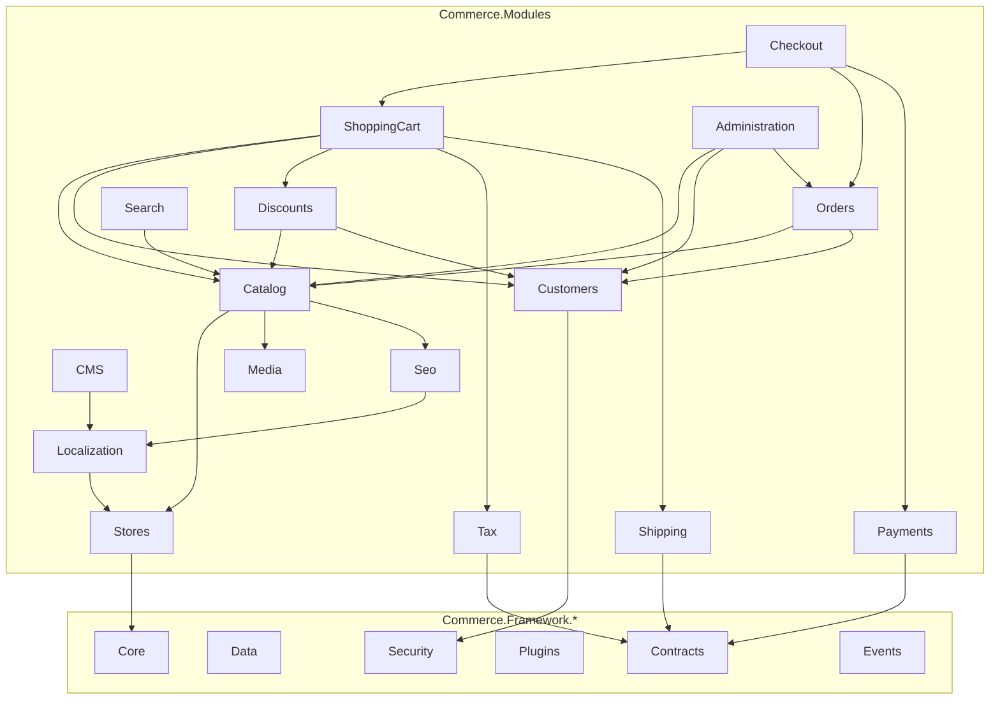

# Commerce Framework — Module Map (PHASE 0)

**Purpose:** Define commerce module boundaries, responsibilities, dependencies, and interfaces before implementation.

---

## 1. Module Architecture Principles

1. **Each module is a vertical slice** — Domain + Application + (optional) Infrastructure within `Commerce.Modules.{Name}/`
2. **Modules communicate through contracts** — never through another module's Infrastructure
3. **Cross-cutting capabilities live in Framework** — caching, events, localization, SEO, etc.
4. **Plugins extend modules** — payment, shipping, tax, search, storage, themes
5. **No generic CRUD** — specific services (`IProductService`, not `IGenericService<T>`)

---

## 2. Framework Layer Modules

These are not business modules — they provide platform capabilities consumed by all business modules.

| Framework project | Responsibility | Key abstractions |
|---|---|---|
| `Commerce.Framework.Core` | Primitives: Result, errors, entity base, auditing, configuration | `Entity`, `Result<T>`, `IWorkContext` |
| `Commerce.Framework.Domain` | Shared domain concepts: money, address value objects | `Money`, `Address`, `Email` |
| `Commerce.Framework.Contracts` | Cross-module interfaces | `IPaymentProvider`, `IShippingProvider`, `ITaxProvider` |
| `Commerce.Framework.Application` | Shared application patterns | `ICommandHandler<T>`, validation base |
| `Commerce.Framework.Infrastructure` | External integrations, email, file I/O | `IEmailSender`, `IFileProvider` |
| `Commerce.Framework.Data` | DbContext, migrations, repositories (specific, not generic) | `CommerceDbContext`, `ICommerceMigration` |
| `Commerce.Framework.Security` | Auth, permissions, password hashing | `IPermissionService`, `ICurrentCustomer` |
| `Commerce.Framework.Logging` | Structured logging, audit | `IAuditLogger` |
| `Commerce.Framework.Contracts.Caching` | Cache management | `ICacheManager`, `ICacheKeyBuilder`, `ICacheInvalidator` |
| `Commerce.Framework.Events` | Integration event bus, domain event dispatch | `IEventBus`, `IIntegrationEvent`, `IDomainEventDispatcher` |
| `Commerce.Framework.Scheduling` | Background tasks | `IScheduledTask`, `IScheduler` |
| `Commerce.Framework.Plugins` | Plugin discovery, lifecycle | `ICommercePlugin`, `IPluginManager` |
| `Commerce.Framework.Media` | Media abstraction | `IMediaStorage`, `IMediaService` |
| `Commerce.Framework.Localization` | i18n engine | `ILocalizationService`, `ILanguageService` |
| `Commerce.Framework.Seo` | URL/slug/SEO | `IUrlService`, `ISlugService`, `ISeoService` |
| `Commerce.Framework.Search` | Search abstraction | `ISearchEngine`, `ISearchProvider` |
| `Commerce.Framework.Themes` | Theme engine | `IThemeProvider`, `IThemeContext` |
| `Commerce.Framework.Cms` | Widget engine | `IWidget`, `IWidgetProvider`, `IWidgetZoneRegistry` |

---

## 3. Business Modules

### 3.1 Catalog Module (PHASE 8 — implemented)

**Path:** `src/Commerce/Modules/Catalog/`

| Layer | Contents |
|---|---|
| Domain | `Product`, `Category`, `ProductAttributeDefinition`, `ProductAttributeOption`, `ProductAttributeAssignment`, `ProductAttributeValue`, `ProductVariant`, `ProductVariantAttribute`, `ProductOffer`, `Sku` |
| Contracts | `IProductReader`, `ICategoryReader`, `IProductAttributeReader`, `IProductVariantReader`, `IProductOfferReader`, `IPricingService`, `ICatalogPricingReader`, `ResolvedPriceDto` |
| Application | `ProductService`, `CategoryService`, `AttributeService`, `VariantService`, `OfferService`, `PricingService`, `StorefrontCatalogService` |
| Events | `ProductCreated/Updated/Published`, `VariantCreated/Updated`, `OfferCreated/Updated` |

**Responsibilities (Phase 8):**
- Product types: Simple (full), Variant (full), Digital (catalog-only), Grouped/Bundle (foundation)
- Reusable product attributes with localization
- Variants with attribute combinations and duplicate prevention
- Store-scoped, currency-explicit offers — **Cart consumes offers, not Product.Price**
- `IPricingService` / `ResolvedPriceDto` price snapshot for future checkout
- Public storefront read API (published/visible/active only)
- Category hierarchy preserved from Phase 4

**Depends on:** Framework (Core, Domain, Data, Contracts/Tenancy), Store context for pricing  
**Depended on by (future):** ShoppingCart, Checkout, Orders, Search, Discounts — via **Contracts only**

**Does NOT depend on:** Customers, Orders, Checkout, Payments, Shipping, Inventory (verified by architecture tests)

### 3.2 Media Module (PHASE 9 — implemented)

**Path:** `src/Commerce/Modules/Media/`

| Layer | Contents |
|---|---|
| Domain | `MediaAsset`, `FileSignatureValidator`, `StorageKeyGenerator`, `FileNameSanitizer` |
| Contracts | `IMediaStorage`, `IMediaReader`, `IMediaService`, `IMediaUrlResolver`, `IImageProcessor` |
| Application | `MediaService`, `MediaUploadValidator`, `MediaSettings` |
| Infrastructure | `LocalMediaStorage`, `BasicImageProcessor`, `EfMediaAssetRepository` |

**Responsibilities:** Upload, metadata, store-scoped storage, public/private delivery, thumbnails, media library API.

**Catalog integration:** `ProductMedia`, `ProductVariantMedia`, `CategoryMedia` relationship tables; Catalog.Application → Media.Contracts only.

**Store integration:** `StoreMedia` foundation (Logo, Favicon, Banner roles).

### 3.3 Cart Module (PHASE 10 — implemented)

**Path:** `src/Commerce/Modules/Cart/`

| Layer | Contents |
|---|---|
| Domain | `ShoppingCart`, `CartItem`, `CartStatus` |
| Contracts | `ICartService`, `CartDto`, `CartItemDto`, `CartMergeResultDto` |
| Application | `CartService`, `CartOfferValidator`, `CartTotalsCalculator`, `CartItemDisplayEnricher`, `CartSettings` |
| Infrastructure | `EfCartRepository`, `GuestCartCookieManager`, `CartGuestTokenGenerator` |

**Purchase chain:** `CartItem → OfferId → ICatalogPricingReader → ResolvedPriceDto` (never client prices)

**Cart invariant:** one active cart per **Store + Customer + Currency** or **Store + GuestToken + Currency**

**API:** `GET/DELETE /api/cart`, `POST/PUT/DELETE /api/cart/items`, `POST /api/cart/merge`

**Depends on:** Catalog.Contracts, Customers.Contracts, Store context, Settings  
**Does NOT depend on:** Catalog.Infrastructure, Media.Infrastructure, Checkout, Orders

### 3.4 Checkout Module (PHASE 11 — implemented)

**Path:** `src/Commerce/Modules/Checkout/`

| Layer | Contents |
|---|---|
| Domain | `CheckoutSession`, `CheckoutSessionItem`, `CheckoutAddressSnapshot`, `CheckoutStatus` |
| Contracts | `ICheckoutService`, `ICheckoutOrderPreparationService`, provider contracts (`IShippingRateProvider`, `ITaxCalculator`, `IDiscountCalculator`, `IPaymentMethodProvider`) |
| Application | `CheckoutService`, `CheckoutOfferValidator`, `CheckoutTotalsCalculator`, `CheckoutRequiresShippingEvaluator`, no-op providers |
| Infrastructure | `EfCheckoutRepository`, `CheckoutModelContributor`, `CheckoutSettingDefinitionProvider` |

**Purchase chain:** `Cart → Offer revalidation → ICatalogPricingReader → checkout line snapshots → totals`

**Checkout invariant:** one active checkout per cart; cart mutations mark session `RequiresReview`

**Terminal state (Phase 11):** `ReadyForOrder` via `ICheckoutOrderPreparationService` — completed to `Completed` by Orders module after order creation

**API:** `/api/checkout/*` (start, addresses, shipping/payment selection, refresh, validate)

**Depends on:** Cart.Contracts, Catalog.Contracts, Customers.Contracts, Store.Contracts  
**Does NOT depend on:** Cart/Catalog/Customers Infrastructure, Order, Payment, Shipping, Tax Infrastructure

### 3.4.1 Orders Module (PHASE 12 + PHASE 31 — implemented)

**Path:** `src/Commerce/Modules/Orders/`

| Layer | Contents |
|---|---|
| Domain | `Order`, `OrderItem`, `OrderStatusHistory`, **`ReturnCase`**, **`ReturnCaseItem`**, `OrderCreationIdempotency`, `StoreOrderNumberSequence`, `OrderAddressSnapshot` |
| Contracts | `IOrderService`, `IAdminOrderService`, **`IOrderLifecycleService`**, **`IReturnAdminService`**, order/return DTOs |
| Application | `OrderService`, **`OrderLifecycleService`**, **`ReturnCaseService`**, `OrderNumberGenerator`, `OrderMapper` |
| Infrastructure | `EfOrderRepository`, **`EfReturnCaseRepository`**, `OrderCreationTransaction`, `OrdersPermissionContributor`, `OrdersModelContributor` |

**Purchase chain:** `ReadyForOrder Checkout → ICheckoutOrderPreparationService → immutable Order + snapshots`

**Post-order lifecycle (Phase 31):** confirm → processing → complete; partial cancel; server-side refund; return cases (request → approve/reject → return shipment → receive → restock → refund → complete)

**Status dimensions (separate):** `OrderStatus`, `PaymentStatus`, `FulfillmentStatus`, `ReturnStatus` (on ReturnCase), shipment status in Shipping module, refund status in Payments module

**Order invariant:** one order per checkout; totals computed server-side; financial/audit history append-only

**Order numbering:** `ORD-{year}-{sequence:D6}` per store via `StoreOrderNumberSequence`

**API:** `/api/orders/*`, `/api/admin/orders/*`, **`/api/admin/returns/*`**

**Depends on:** Checkout.Contracts, Cart.Contracts, Catalog.Contracts, Customers.Contracts, Store.Contracts, **Inventory.Contracts**, **Payments.Contracts**, **Shipping.Contracts**  
**Does NOT depend on:** Checkout/Cart/Catalog/Customers Infrastructure, Payment/Shipping/Inventory Infrastructure

### 3.4.2 Inventory Module (PHASE 13 + PHASE 29 — implemented)

**Path:** `src/Commerce/Modules/Inventory/`

| Layer | Contents |
|---|---|
| Domain | `InventoryItem`, `InventoryMovement`, `InventoryReservation`, **`Warehouse`**, **`StockLocation`** |
| Contracts | `IInventoryReader`, `IInventoryOrderService`, `IInventoryReservationService`, `IInventoryAdminService`, **`IWarehouseAdminService`**, **`IInventoryTransferService`** |
| Application | `InventoryReader`, `InventoryOrderService`, `InventoryAdminService`, `InventoryReservationService`, **`WarehouseAdminService`**, **`InventoryTransferService`**, **`InventoryWarehouseAllocator`**, **`OrderPaidInventoryHandler`**, expiration job handler |
| Infrastructure | `EfInventoryRepository`, `InventoryModelContributor`, `InventoryPermissionContributor`, recurring job registration |

**Stock model:** `OnHand`, `Reserved`, `Available`, `Incoming`; optional `LowStockThreshold`; one row per `(StoreId, OfferId, WarehouseId)`

**Purchase chain:** `OfferId → InventoryItem(s) per warehouse → aggregated availability for cart/checkout`

**Reservation lifecycle:** `Active → Released | Converted | Expired | Cancelled`; expiration via recurring job `inventory.reservations.expire`

**Order integration:** reserve on create; release on cancel; **convert to sale on payment** via `IOrderPaidHandler`; **partial release on partial cancel**; **restock on cancel/refund/return** (Phase 31)

**API:** `/api/admin/inventory/*`, `/api/admin/inventory/warehouses/*`

**Depends on:** Catalog.Contracts, Store.Contracts, Orders.Contracts, **Commerce.Framework.Scheduling**  
**Does NOT depend on:** Catalog/Orders Infrastructure

**Depended on by:** Cart, Checkout, Orders (via Contracts), Catalog storefront pricing (via Contracts)

### 3.5 Customers Module

**Path:** `Commerce.Modules/Customers/`

| Layer | Contents |
|---|---|
| Domain | `Customer`, `CustomerRole`, `Address`, `ExternalAuthRecord`, `NewsletterSubscription`, `Affiliate`, `CustomerPreference`, `CustomerSegment`, `LoyaltyAccount`, `LoyaltyReward`, `StoreCreditAccount`, `CustomerActivityLog` |
| Application | `ICustomerService`, `ICustomerRegistrationService`, `ICustomerAuthenticationService`, `IAddressService`, `ICustomerRoleService`, `ICustomerPreferenceService`, `ICustomerSegmentAdminService`, `ILoyaltyService`, `ILoyaltyRewardAdminService`, `IStoreCreditService`, `ICustomerActivityService`, `ICustomerAccountAdminService`, `ICustomerAccountStorefrontService` |
| Events | `CustomerRegisteredEvent`, `CustomerLoggedInEvent`, `CustomerPasswordChangedEvent` |

**Responsibilities:**
- Registration, login, logout, password reset
- Guest customers and cart merge on login
- Roles and permissions (via Security framework)
- Customer attributes (via GenericAttribute)
- Newsletter subscriptions
- Customer preferences, segments, loyalty points/rewards, store credit (transaction-ledgers)
- Purchase history and activity (admin + storefront)
- Order-paid loyalty earning (`IOrderPaidHandler`)
- Affiliates, referral codes, commission ledger (Phase 33)

**Depends on:** Framework (Core, Data, Security, Events)  
**Depended on by:** ShoppingCart, Checkout, Orders, Discounts

### 3.6 ShoppingCart Module (superseded by 3.3 Cart — PHASE 10)

**Path:** `Commerce.Modules/ShoppingCart/`

| Layer | Contents |
|---|---|
| Domain | `ShoppingCartItem`, `CartTotals` (value object) |
| Application | `IShoppingCartService`, `ICartCalculationService`, `ICartValidationService` |
| Events | `CartUpdatedEvent`, `CartItemAddedEvent`, `CartItemRemovedEvent` |

**Responsibilities:**
- Add/remove/update cart items
- Product, attribute, and bundle validation
- Price calculation (base → tier → customer → store)
- Discount, tax, shipping calculation integration
- Guest and authenticated cart persistence
- Cart merge after login
- Customer-entered price where permitted

**Depends on:** Catalog, Customers, Discounts (contracts), Tax (contracts), Shipping (contracts)  
**Depended on by:** Checkout

### 3.4 Checkout Module

**Path:** `Commerce.Modules/Checkout/`

| Layer | Contents |
|---|---|
| Domain | `CheckoutState`, `CheckoutAttribute`, `CheckoutAttributeValue` |
| Application | `ICheckoutService`, `ICheckoutPipeline`, `ICheckoutStep` (per step) |
| Events | `CheckoutStartedEvent`, `CheckoutCompletedEvent` |

**Pipeline steps (each implements `ICheckoutStep`):**
1. `CartValidationStep`
2. `CustomerValidationStep`
3. `BillingAddressStep`
4. `ShippingAddressStep`
5. `ShippingMethodStep`
6. `PaymentMethodStep`
7. `DiscountApplicationStep`
8. `TaxCalculationStep`
9. `OrderReviewStep`
10. `OrderCreationStep`
11. `PaymentProcessingStep`
12. `ConfirmationStep`

**Depends on:** ShoppingCart, Customers, Orders, Payments (contracts), Shipping (contracts), Tax (contracts), Discounts  
**Depended on by:** Orders

### 3.5 Orders Module

**Path:** `Commerce.Modules/Orders/`

| Layer | Contents |
|---|---|
| Domain | `Order`, `OrderItem`, `OrderNote`, `ReturnCase`, `Shipment`, `ShipmentItem`, `RecurringPayment` |
| Application | `IOrderService`, `IOrderProcessingService`, `IOrderStateMachine`, `IShipmentService`, `IReturnService` |
| Events | `OrderCreatedEvent`, `OrderPaidEvent`, `OrderCancelledEvent`, `OrderShippedEvent`, `ShipmentCreatedEvent` |

**Responsibilities:**
- Order creation from checkout
- Order numbering
- Explicit order state machine (status transitions)
- Payment status, shipping status tracking
- Order notes, invoices
- Refunds, cancellations, returns
- Shipment management
- Recurring payments
- Downloadable item entitlements

**Depends on:** Catalog, Customers, Payments (contracts)  
**Depended on by:** Administration, Search (order history)

### 3.6 Payments Module

**Path:** `Commerce.Modules/Payments/`

| Layer | Contents |
|---|---|
| Domain | `PaymentMethodInfo`, `WalletHistoryEntry`, `GiftCard`, `GiftCardUsageHistory` |
| Application | `IPaymentService`, `IPaymentMethodProvider`, `IGiftCardService`, `IWalletService` |

**Responsibilities:**
- Payment method registration and discovery
- Payment processing orchestration (delegates to `IPaymentProvider` plugins)
- Wallet and gift card management
- Payment status tracking

**Plugin contract:** `IPaymentProvider` with `CreatePayment`, `VerifyPayment`, `CapturePayment`, `RefundPayment`, `CancelPayment`

**Depends on:** Framework (Contracts, Plugins), Orders (contracts)  
**Depended on by:** Checkout, Orders

### 3.7 Shipping Module

**Path:** `Commerce.Modules/Shipping/`

| Layer | Contents |
|---|---|
| Domain | `ShippingMethod`, `ShippingRateByWeight`, `ShippingRateByTotal`, `DeliveryTime` |
| Application | `IShippingService`, `IShippingRateCalculator` |

**Plugin contract:** `IShippingProvider`

**Built-in methods:** Flat rate, weight-based, total-based, local pickup

**Depends on:** Framework (Contracts, Plugins)  
**Depended on by:** ShoppingCart, Checkout

### 3.8 Tax Module (Phase 16 — IMPLEMENTED)

**Path:** `src/Commerce/Modules/Tax/`

| Layer | Contents |
|---|---|
| Domain | `TaxCategory`, `TaxRate`, `TaxZone`, zone rules (country/state/postal) |
| Contracts | `ITaxCalculationService`, `ITaxProvider`, calculation DTOs, admin DTOs |
| Application | `TaxCalculationService`, `InternalTaxProvider`, `CheckoutTaxCalculator`, `TaxZoneMatcher`, `TaxAmountCalculator`, `TaxAdminService` |
| Infrastructure | EF persistence, permissions, settings, development seeder |

**Responsibilities:**
- Store-scoped tax categories, zones, and rates
- Centralized tax calculation (never in controllers)
- Built-in `InternalTaxProvider` with geographic zone matching
- Inclusive/exclusive pricing via store setting
- Customer and category exemptions
- Post-discount taxable base (Pricing integration)
- Shipping tax when applicable
- Checkout integration via existing `ITaxCalculator`
- Order tax snapshots (`OrderTaxLine`)

**Plugin contract:** `ITaxProvider`

**Depends on:** Framework, Store, Catalog (contracts), Customers (contracts), Pricing (contracts), Checkout (contracts)  
**Depended on by:** Checkout (calculator bridge), Orders (snapshots via checkout preparation)

### 3.9 Pricing / Discounts Module (Phase 14 — IMPLEMENTED)

**Path:** `src/Commerce/Modules/Pricing/`

| Layer | Contents |
|---|---|
| Domain | `Discount`, `DiscountTarget`, `Coupon`, `CouponUsage` |
| Contracts | `IPriceCalculationService`, `ICouponValidationService`, `ICouponUsageService`, admin DTOs |
| Application | `DiscountCalculationEngine`, `PriceCalculationService`, `DiscountAwarePricingService`, `CheckoutDiscountCalculator` |
| Infrastructure | EF persistence, `EfPricingRepository`, permissions, migrations |

**Responsibilities:**
- Authoritative pricing pipeline (base offer price + discount layer)
- Percentage/fixed discounts with caps, minimums, eligibility, store/currency scoping
- Targeting: Product, Variant, Offer, Category, Cart
- Priority and stacking (compound sequential for stackable)
- Coupon engine with case-insensitive codes and usage limits
- Atomic coupon consumption at order creation

**Depends on:** Catalog (contracts + application for pricing decorator), Customers (contracts), Checkout (contracts for `IDiscountCalculator`)  
**Depended on by:** Cart, Checkout, Orders (via contracts only)

### 3.10 Shipping Module (Phase 15 + Phase 30 — IMPLEMENTED)

**Path:** `src/Commerce/Modules/Shipping/`

| Layer | Contents |
|---|---|
| Domain | `ShippingMethod`, `ShippingZone`, `ShippingRate`, zone rules, **`Shipment`**, **`ShipmentItem`** |
| Contracts | `IShippingCalculationService`, `IShippingProvider`, **`IShipmentAdminService`**, admin + shipment DTOs |
| Application | `ShippingCalculationService`, `FlatRateShippingProvider`, **`PickupShippingProvider`**, `ShippingZoneMatcher`, `ShippingRateCalculator`, `ShippingAdminService`, **`ShipmentAdminService`**, **`OrderFulfillmentSync`** |
| Infrastructure | EF persistence (incl. shipments), permissions, settings |
| Plugins | **`Commerce.Plugin.Shipping.FlatRate`**, **`Commerce.Plugin.Shipping.Pickup`** |

**Responsibilities:**
- Zones, methods, rates (flat, weight, subtotal, quantity, free shipping)
- Provider plugin architecture via `IShippingProvider`
- Pickup methods without shipping address
- Shipment records, tracking, fulfillment sync
- Resilient multi-provider checkout calculation
- Digital/mixed cart behavior (Phase 15 + 20)

**Depends on:** Framework, Store, Catalog (contracts), Checkout (contracts), Orders (contracts)  
**Depended on by:** Checkout, Orders, Notifications (`IShipmentCreatedHandler`)

### 3.11 Payments Module (Phase 17 — IMPLEMENTED)

**Path:** `src/Commerce/Modules/Payments/`

| Layer | Contents |
|---|---|
| Domain | `Payment`, `PaymentTransaction`, `PaymentMethod`, `PaymentAttempt`, `Refund`, `RefundTransaction`, `PaymentCallbackRecord` |
| Contracts | `IPaymentProvider`, `IPaymentService`, `IOrderPaymentSyncService`, admin/callback DTOs |
| Application | `PaymentService`, `PaymentCheckoutMethodProvider`, `PaymentAdminService`, `PaymentCallbackDispatcher`, `OrderPaymentSyncService`, `PaymentProviderSettingsReader` |
| Infrastructure | EF persistence, permissions, settings, development seeder |

**Plugins:**
| Plugin | SystemName | Phase |
|---|---|---|
| Manual | `Payment.Manual` | 17 |
| ZarinPal | `Payment.ZarinPal` | 35 |
| Stripe | `Payment.Stripe` | 35 |

**Responsibilities:**
- Provider-independent payment orchestration
- Transaction history and refund lifecycle
- Checkout method discovery via `IPaymentMethodProvider`
- Idempotent payment creation and callbacks
- Order payment status synchronization
- Store-scoped payment method configuration

**Depends on:** Framework, Store, Checkout (contracts), Orders (contracts)  
**Depended on by:** Orders (payment sync), Host (API controllers)

### 3.13 Plugin Runtime (Phase 18 — IMPLEMENTED)

**Path:** `src/Commerce/Framework/Plugins/`, `src/Commerce/Framework/PluginContracts/`

| Layer | Contents |
|---|---|
| PluginContracts | `ICommercePlugin`, `PluginDescriptor`, discovery/lifecycle/admin contracts, `IPluginUiContributor` |
| Framework.Plugins | Discovery, manifest validation, `CollectibleAssemblyLoadContext` loading, lifecycle manager, package service, static files, persistence |

**First plugin:** `Commerce.Plugin.Payment.Manual` deployed to `Plugins/Payment.Manual/`

**Responsibilities:**
- Runtime discovery from configurable `Plugins/` directory
- Manifest validation before code execution
- Plugin install/enable/disable/uninstall with DB state
- ZIP package install with path traversal protection
- Dynamic provider registration (`IPaymentProvider`, future providers)
- Plugin static file serving

**Does NOT replace:** compile-time Commerce module runtime

### 3.13a Plugin SDK (Phase 41 — IMPLEMENTED)

**Path:** `src/Commerce/PluginSdk/`

| Project | Contents |
|---|---|
| `Commerce.Plugin.Contracts` | Package layout, reference rules, compatibility models |
| `Commerce.Plugin.Sdk` | Validation, ZIP pack/archive validation, MSBuild targets |
| `Commerce.Plugin.Testing` | `PluginTestHostBuilder`, manifest test factory |
| `Commerce.Plugin.Template` | CLI scaffold template |
| `Commerce.Plugin.Cli` | Global tool: `commerce plugin create/build/test/pack/validate` |

**Shared contracts:** `Commerce.Framework.PluginContracts.Manifest` (parser + validator used by runtime and SDK)

**Security:** validate/pack inspect static files only — no plugin code execution

**Docs:** `docs/commerce/PLUGIN-DEVELOPMENT.md`

### 3.13b Disaster Recovery (Phase 43 — IMPLEMENTED)

**Path:** `src/Commerce/Modules/DisasterRecovery/`

| Layer | Contents |
|---|---|
| Contracts | Backup/recovery/integrity APIs, validity status model |
| Application | Backup orchestration, retention, verification, recovery test |
| Infrastructure | SQL backup/verify, file archivers, jobs, health probe, admin permissions |

**RPO/RTO defaults:** 24h / 4h — see `docs/commerce/DISASTER-RECOVERY.md`

**Rule:** Backups are not valid for production recovery until recovery testing passes.

### 3.13c Deployment / Docker (Phase 44 — IMPLEMENTED)

**Path:** `deploy/docker/`, `scripts/deploy/`

| Artifact | Purpose |
|---|---|
| `Dockerfile` | Multi-stage Commerce.Host image |
| `docker-compose.yml` | Development stack (SQL Server, Redis, commerce) |
| `docker-compose.staging.yml` / `.production.yml` | Caddy HTTPS, restart policies, startup migrations |
| `.env.example` | Non-secret template — production secrets stay out of git |
| `DeploymentStartupHostedService` | DB wait + auto-migrate when installed |

**Docs:** `docs/commerce/DEPLOYMENT.md`, `docs/commerce/ENVIRONMENT-CONFIGURATION.md`

### 3.13d Smartstore Import (Phase 46 — IMPLEMENTED)

**Path:** `src/Commerce/Modules/SmartstoreImport/`

| Layer | Contents |
|---|---|
| Domain | `ImportRun`, `ImportIdMapping`, `ImportIssue` |
| Contracts | `ISmartstoreImportService`, import options/result DTOs |
| Application | Importer abstractions, Smartstore table/entity constants |
| Infrastructure | SQL parser, orchestration, 16 entity importers |

**Behavior:** Discovers schema from supplied SQL export; imports only present tables; tracks legacy IDs; logs warnings/errors for every skipped or partial row.

**Docs:** `docs/commerce/SMARTSTORE-IMPORT-MAPPING.md`, `data/smartstore/README.md`

**Script:** `scripts/migration/run-smartstore-import.ps1`

**Tests:** `Commerce.Tests.Unit.SmartstoreImport` (14 passing)

**Reconciliation (Phase 47):** `ISmartstoreReconciliationService` — classified discrepancy reports after import

**Docs:** `docs/commerce/SMARTSTORE-RECONCILIATION.md`

### 3.14 Marketing Module

**Path:** `Commerce.Modules/Marketing/`

| Layer | Contents |
|---|---|
| Domain | `Campaign` (shared with Discounts or separate) |
| Application | `IEmailCampaignService`, `INewsletterService` |

**Depends on:** Customers, Messaging (Framework.Infrastructure)  
**Depended on by:** Administration

### 3.11 CMS Module

**Path:** `Commerce.Modules/Cms/`

| Layer | Contents |
|---|---|
| Domain | `Topic`, `Menu`, `MenuItem` |
| Application | `ITopicService`, `IMenuService`, `IContentBlockService` |

**Depends on:** Framework (Cms/widgets, Localization, Seo), Stores  
**Depended on by:** Commerce.Web (storefront rendering)

### 3.12 Media Module

**Path:** `Commerce.Modules/Media/`

| Layer | Contents |
|---|---|
| Domain | `MediaFile`, `MediaFolder`, `MediaTag` |
| Application | `IMediaService`, `IMediaUploadService`, `IThumbnailService` |

**Depends on:** Framework (Media/storage plugins)  
**Depended on by:** Catalog, CMS, Themes

### 3.13 Search Module

**Path:** `Commerce.Modules/Search/`

| Layer | Contents |
|---|---|
| Application | `ISearchService`, `IProductSearchService`, `ICategorySearchService` |

**Initial provider:** Database search (Phase 15)  
**Future plugins:** Elasticsearch, OpenSearch, Meilisearch

**Depends on:** Catalog (contracts), Framework (Search)  
**Depended on by:** Commerce.Web, API

### 3.14 Reviews Module (Phase 25 — IMPLEMENTED)

**Path:** `Commerce.Modules/Reviews/`

| Layer | Contents |
|---|---|
| Domain | `ProductReview`, `Wishlist`, `WishlistItem`, `ReviewModerationStatus` |
| Application | `IReviewStorefrontService`, `IWishlistStorefrontService`, `IReviewAdminService`, `IWishlistAdminService` |
| Infrastructure | EF repository, permissions, migration contributor |

**Depends on:** Catalog, Customers, Orders (purchase verification), Store  
**Depended on by:** Storefront, Administration

### 3.15 Promotions Module (Phase 26 — IMPLEMENTED)

**Path:** `Commerce.Modules/Promotions/`

| Layer | Contents |
|---|---|
| Domain | `Promotion`, `PromotionCondition`, `PromotionAction`, `PromotionUsage` |
| Application | `PromotionRuleEngine`, `PromotionEvaluationService`, `PromotionAdminService` |
| Infrastructure | EF repository, permissions, migration contributor |

**Depends on:** Pricing, Catalog, Customers, Store  
**Depended on by:** Pricing (`PriceCalculationService`), Administration

### 3.16 SEO Module (Phase 26 — IMPLEMENTED)

**Path:** `Commerce.Modules/Seo/`

| Layer | Contents |
|---|---|
| Framework | `Commerce.Framework.Seo` — slug normalization |
| Domain | `UrlRecord`, `SeoMetadata`, `SeoSettings` |
| Application | `ISeoAdminService`, `ISeoStorefrontService` |
| Infrastructure | EF repository, permissions, migration contributor |

**Depends on:** Framework (Seo), Store  
**Depended on by:** Host (`/robots.txt`, `/sitemap.xml`), Storefront slug resolution

### 3.17 Notifications Module (Phase 27 — IMPLEMENTED)

**Path:** `Commerce.Modules/Notifications/`

| Layer | Contents |
|---|---|
| Domain | `NotificationTemplate`, `NotificationLog`, `InAppNotification` |
| Contracts | Admin DTOs, `INotificationEventPublisher`, `INotificationChannelProvider`, in-app storefront service |
| Application | Template renderer/selector, dispatcher, channel providers, event handlers, retry hosted service |
| Infrastructure | EF repository, permissions, migration contributor |

**Depends on:** Framework (Email, SMS abstractions), Customers, Orders, Downloads (handler contracts), Scheduling  
**Depended on by:** Administration, Storefront (in-app notifications)

### 3.18 Scheduling Module (Phase 28 — IMPLEMENTED)

**Path:** `Commerce.Modules/Scheduling/`

| Layer | Contents |
|---|---|
| Framework | `Commerce.Framework.Scheduling` — scheduler/handler/lock abstractions |
| Domain | `BackgroundJob`, `BackgroundJobExecution`, `RecurringJobSchedule`, `JobDistributedLock` |
| Application | Scheduler, executor, processor hosted service, admin service, stub handlers |
| Infrastructure | EF repository (atomic claim), permissions, migration contributor |

**Depends on:** Framework (Core, Data)  
**Depended on by:** Notifications, Search, Integration, all modules enqueueing background work

### 3.19 Integration Module (Phase 34 — IMPLEMENTED)

**Path:** `Commerce.Modules/Integration/`

| Layer | Contents |
|---|---|
| Framework | `Commerce.Framework.Events` — `IEventBus`, domain event interceptor |
| Domain | `WebhookSubscription`, `WebhookDelivery`, `ApiClient`, `ProcessedIntegrationEvent` |
| Contracts | Integration event records, webhook/API admin, external API DTOs |
| Application | Webhook dispatch/delivery, signature service, API client auth, event bridges |
| Infrastructure | EF repository, permissions, migration contributor |

**Depends on:** Framework (Events, Data, Scheduling), Orders, Customers, Catalog, Inventory  
**Depended on by:** Host (admin + external API controllers)

### 3.20 Localization Module

**Path:** `Commerce.Modules/Localization/`

| Layer | Contents |
|---|---|
| Domain | `Language`, `LocaleStringResource`, `LocalizedProperty` |
| Application | `ILanguageService`, `ILocalizationService`, `ILocalizedEntityService` |

**Depends on:** Framework (Localization), Stores  
**Depended on by:** All modules (via localization service)

### 3.17 Localization Module

**Path:** `Commerce.Modules/Localization/`

| Layer | Contents |
|---|---|
| Domain | `Language`, `LocaleStringResource`, `LocalizedProperty` |
| Application | `ILanguageService`, `ILocalizationService`, `ILocalizedEntityService` |

**Depends on:** Framework (Localization), Stores  
**Depended on by:** All modules (via localization service)

### 3.18 Administration Module

**Path:** `Commerce.Modules/Administration/`

| Layer | Contents |
|---|---|
| Application | Admin-specific services, dashboard data, system info |

**Depends on:** All business modules (via their application services)  
**Depended on by:** Commerce.Web (Areas/Admin)

### 3.19 Analytics Module

**Path:** `Commerce.Modules/Analytics/`

| Layer | Contents |
|---|---|
| Contracts | `IDashboardService`, `IReportsService`, report DTOs, `ReportFilterQuery` |
| Application | `DashboardService`, `ReportsService`, filter normalization |
| Infrastructure | `EfAnalyticsReadRepository`, `AnalyticsPermissionContributor` |

**Depends on:** Orders, Payments, Customers, Catalog, Inventory, Pricing, Promotions, Downloads, Cart, Checkout (read-only EF projections)  
**Depended on by:** Host (`/api/admin/dashboard`, `/api/admin/reports/*`)

### 3.20 Audit Module (PHASE 37 — implemented)

**Path:** `Commerce.Modules/Audit/`

| Layer | Contents |
|---|---|
| Domain | `AuditEntry` (append-only, hash chain) |
| Contracts | `IAuditQueryService`, audit DTOs, query models |
| Application | `AuditWriter`, `AuditSanitizer`, `AuditQueryService` |
| Infrastructure | `EfAuditRepository`, security/admin middleware, permissions, actor context |

**Cross-cutting:** `Commerce.Framework.Contracts.Audit.IAuditPublisher` — modules publish audit events without depending on Audit infrastructure.

**Depends on:** Core; Framework.Data  
**Depended on by:** Host (`/api/admin/audit/*`); all modules via `IAuditPublisher` hooks

### 3.21 Observability Module (PHASE 38 — implemented)

**Path:** `Commerce.Modules/Observability/`

| Layer | Contents |
|---|---|
| Application | `LogSanitizer` |
| Infrastructure | Correlation/request middleware, health checks, `HttpCorrelationContext` |
| Framework | `ICorrelationContext`, `CommerceLogging`, `CommerceMetrics`, `CommerceTracing` |

**Depends on:** Core, Framework.Application, Framework.Data, PluginContracts  
**Depended on by:** Host (`/health/*`, middleware pipeline)

### 3.22 Cache Module (PHASE 39 — implemented)

**Path:** `Commerce.Modules/Cache/`

| Layer | Contents |
|---|---|
| Application | `CachedStorefrontCatalogService`, `CachedSearchQueryService`, `CachedSettingService`, `CacheCatalogInvalidator`, `CachePerformanceProfiler` |
| Infrastructure | Redis provider, output cache policies, DI decorators |
| Framework | `ICacheManager`, `ICacheKeyBuilder`, `ICacheInvalidator`, `IDistributedLockProvider`, memory/distributed/composite managers |

**Depends on:** Catalog, Search, Store, Framework.Infrastructure  
**Depended on by:** Host (storefront output cache, cached reads)

**Safety:** `CacheGuard` blocks financial/transactional key segments. Cart, checkout, payment, order paths are not decorated.

### 3.23 Admin UI (PHASE 40 — implemented)

**Path:** `frontend/commerce-ui/`

| Library | Role |
|---|---|
| `@commerce/ui` | Admin page shell, data table, filters, bulk actions, form fields, toasts, store context |
| `@commerce/layout` | Grouped admin navigation (`ADMIN_NAV_GROUPS`), responsive shell |
| `@commerce/shared` | Enhanced pagination, confirm dialog, `PageState` including `ready` |
| `@commerce/localization` | Persisted locale, admin i18n keys, RTL/LTR |

**Reference pages:** products (sort/bulk/export), orders (filters/export), settings (typed/search)

### 3.17 Stores Module

**Path:** `Commerce.Modules/Stores/`

| Layer | Contents |
|---|---|
| Domain | `Store`, `StoreMapping` |
| Application | `IStoreService`, `IStoreContext`, `IStoreMappingService`, `ISettingService` |

**Depends on:** Framework (Core)  
**Depended on by:** All modules (store-aware services)

---

## 4. Module Dependency Graph



**Rule:** Arrows represent "depends on contracts/services of" — never Infrastructure-to-Infrastructure across modules.

---

## 5. Module-to-Project Mapping

Each business module follows this project structure:

```
Commerce.Modules/Catalog/
├── Commerce.Modules.Catalog.Domain/
│   └── Entities/, ValueObjects/, Events/, Enums/
├── Commerce.Modules.Catalog.Application/
│   └── Services/, DTOs/, Validators/, Mappings/
└── Commerce.Modules.Catalog/              (optional facade/module registration)
    └── CatalogModule.cs                   (DI registration, migrations list)
```

Persistence configurations live in:
```
Commerce.Framework.Data/
└── Configurations/Catalog/
    ├── ProductConfiguration.cs
    ├── CategoryConfiguration.cs
    └── ...
```

This keeps EF Core out of module Domain projects while avoiding a separate Infrastructure project per module (reducing project count). Module-specific infrastructure (e.g., external API clients) gets its own project only when justified.

---

## 6. Module Registration Pattern

Each module implements `ICommerceModule`:

```csharp
public interface ICommerceModule
{
    string SystemName { get; }
    void ConfigureServices(IServiceCollection services, IConfiguration configuration);
    void ConfigureDbContext(ModelBuilder modelBuilder);
    IEnumerable<Type> GetMigrationTypes();
    IEnumerable<Type> GetPermissionProviders();
    IEnumerable<Type> GetScheduledTasks();
}
```

Registered in `Commerce.Host`:

```csharp
builder.Services.AddCommerceModules(modules =>
{
    modules.AddModule<CatalogModule>();
    modules.AddModule<CustomersModule>();
    // ...
});
```

---

## 7. Module Isolation Enforcement

Architecture tests (Phase 1+) will enforce:

| Test | Rule |
|---|---|
| `Domain_ShouldNotReference_Web` | No module Domain → Commerce.Web |
| `Domain_ShouldNotReference_Infrastructure` | No module Domain → Commerce.Framework.Data |
| `Modules_ShouldNotReference_OtherModuleInfrastructure` | Catalog.Application → Orders.Domain ✓, Catalog → Orders.Infrastructure ✗ |
| `Plugins_ShouldNotReference_ModulesInfrastructure` | Plugins use Contracts only |
| `Core_ShouldNotReference_Plugins` | Framework.Core has zero plugin references |

---

## 8. Module Implementation Order

Aligned with IMPLEMENTATION-ROADMAP phases:

| Phase | Modules |
|---|---|
| 1 | (Foundation only — no modules) |
| 2 | Stores (minimal), Core platform tables |
| 3 | (Plugin engine — no business modules) |
| 4 | Stores, Localization |
| 5 | Catalog |
| 6 | Customers |
| 7 | ShoppingCart |
| 8 | Checkout, Orders |
| 9 | Payments |
| 10 | Shipping |
| 11 | Discounts |
| 12 | CMS |
| 13 | (Themes — framework) |
| 14 | Media |
| 15 | Search |
| 25 | Reviews (ratings, moderation, wishlist) |
| 26 | Promotions (rule engine) + SEO (URLs, metadata, sitemap, robots) |
| 27 | Notifications (email, SMS, in-app templates, event handlers, delivery log) |
| 28 | Scheduling (background jobs, retry, recurring, distributed locks) |
| 16 | Administration |

---

## 9. Gateway Banking Modules (Preserved, Unchanged)

These existing modules remain untouched:

| Module | Status |
|---|---|
| `Gateway.Framework.*` (9 projects) | Preserved |
| `Gateway.Host` | Preserved |
| `Gateway.Bank.Bank1/Bank2` | Preserved |
| `Bank1/Bank2.Service.*` | Preserved |

Commerce modules are added alongside — no renaming or deletion of banking projects.
