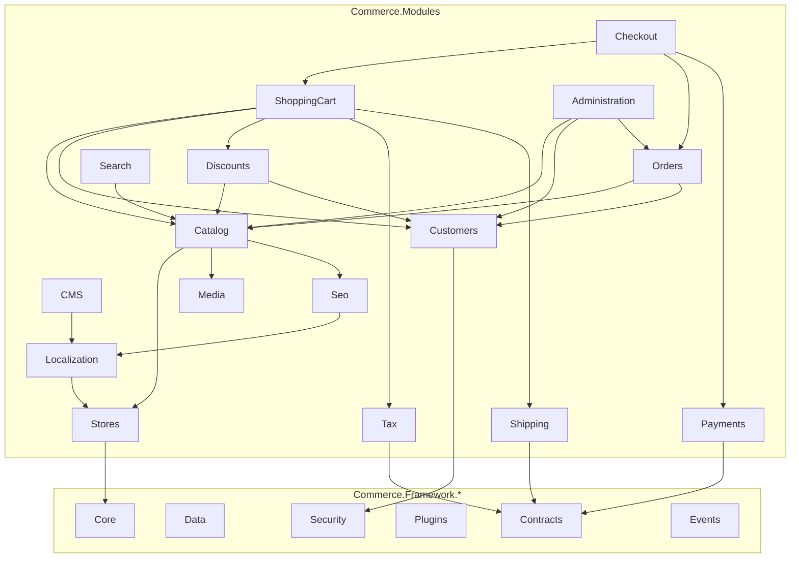

# Commerce Framework — Module Map (PHASE 0)

**Purpose:** Define commerce module boundaries, responsibilities, dependencies, and interfaces before implementation.

---

## 1. Module Architecture Principles

1. **Each module is a vertical slice** — Domain + Application + (optional) Infrastructure within `Commerce.Modules.{Name}/`
2. **Modules communicate through contracts** — never through another module's Infrastructure
3. **Cross-cutting capabilities live in Framework** — caching, events, localization, SEO, etc.
4. **Plugins extend modules** — payment, shipping, tax, search, storage, themes
5. **No generic CRUD** — specific services (`IProductService`, not `IGenericService<T>`)

---

## 2. Framework Layer Modules

These are not business modules — they provide platform capabilities consumed by all business modules.

| Framework project | Responsibility | Key abstractions |
|---|---|---|
| `Commerce.Framework.Core` | Primitives: Result, errors, entity base, auditing, configuration | `Entity`, `Result<T>`, `IWorkContext` |
| `Commerce.Framework.Domain` | Shared domain concepts: money, address value objects | `Money`, `Address`, `Email` |
| `Commerce.Framework.Contracts` | Cross-module interfaces | `IPaymentProvider`, `IShippingProvider`, `ITaxProvider` |
| `Commerce.Framework.Application` | Shared application patterns | `ICommandHandler<T>`, validation base |
| `Commerce.Framework.Infrastructure` | External integrations, email, file I/O | `IEmailSender`, `IFileProvider` |
| `Commerce.Framework.Data` | DbContext, migrations, repositories (specific, not generic) | `CommerceDbContext`, `ICommerceMigration` |
| `Commerce.Framework.Security` | Auth, permissions, password hashing | `IPermissionService`, `ICurrentCustomer` |
| `Commerce.Framework.Logging` | Structured logging, audit | `IAuditLogger` |
| `Commerce.Framework.Caching` | Cache management | `ICacheManager` |
| `Commerce.Framework.Events` | Event bus | `IEventBus`, `IEventHandler<T>` |
| `Commerce.Framework.Scheduling` | Background tasks | `IScheduledTask`, `IScheduler` |
| `Commerce.Framework.Plugins` | Plugin discovery, lifecycle | `ICommercePlugin`, `IPluginManager` |
| `Commerce.Framework.Media` | Media abstraction | `IMediaStorage`, `IMediaService` |
| `Commerce.Framework.Localization` | i18n engine | `ILocalizationService`, `ILanguageService` |
| `Commerce.Framework.Seo` | URL/slug/SEO | `IUrlService`, `ISlugService`, `ISeoService` |
| `Commerce.Framework.Search` | Search abstraction | `ISearchEngine`, `ISearchProvider` |
| `Commerce.Framework.Themes` | Theme engine | `IThemeProvider`, `IThemeContext` |
| `Commerce.Framework.Cms` | Widget engine | `IWidget`, `IWidgetProvider`, `IWidgetZoneRegistry` |

---

## 3. Business Modules

### 3.1 Catalog Module

**Path:** `Commerce.Modules/Catalog/`

| Layer | Contents |
|---|---|
| Domain | `Product`, `Category`, `Manufacturer`, `ProductAttribute`, `ProductVariantCombination`, `TierPrice`, `ProductTag`, `SpecificationAttribute` |
| Application | `IProductService`, `ICategoryService`, `IManufacturerService`, `IProductAttributeService`, `IProductPricingService`, `IProductInventoryService`, `ICategoryTreeService` |
| Events | `ProductCreatedEvent`, `ProductUpdatedEvent`, `ProductDeletedEvent` |

**Responsibilities:**
- Product types: simple, grouped, variant, bundle, downloadable, digital, physical, virtual
- Category hierarchy with tree path queries
- Product attributes and variant combinations
- Tier pricing, customer-specific pricing, store-specific pricing
- Cross-sell and related products
- Category/manufacturer/tag/specification mappings
- Inventory-ready design (stock tracking deferred to later phase)

**Depends on:** Framework (Core, Data, Events, Media, Localization, Seo, Caching)  
**Depended on by:** ShoppingCart, Checkout, Orders, Search, Discounts

### 3.2 Customers Module

**Path:** `Commerce.Modules/Customers/`

| Layer | Contents |
|---|---|
| Domain | `Customer`, `CustomerRole`, `Address`, `ExternalAuthRecord`, `NewsletterSubscription`, `Affiliate` |
| Application | `ICustomerService`, `ICustomerRegistrationService`, `ICustomerAuthenticationService`, `IAddressService`, `ICustomerRoleService` |
| Events | `CustomerRegisteredEvent`, `CustomerLoggedInEvent`, `CustomerPasswordChangedEvent` |

**Responsibilities:**
- Registration, login, logout, password reset
- Guest customers and cart merge on login
- Roles and permissions (via Security framework)
- Customer attributes (via GenericAttribute)
- Newsletter subscriptions
- Wallet and reward points (future)

**Depends on:** Framework (Core, Data, Security, Events)  
**Depended on by:** ShoppingCart, Checkout, Orders, Discounts

### 3.3 ShoppingCart Module

**Path:** `Commerce.Modules/ShoppingCart/`

| Layer | Contents |
|---|---|
| Domain | `ShoppingCartItem`, `CartTotals` (value object) |
| Application | `IShoppingCartService`, `ICartCalculationService`, `ICartValidationService` |
| Events | `CartUpdatedEvent`, `CartItemAddedEvent`, `CartItemRemovedEvent` |

**Responsibilities:**
- Add/remove/update cart items
- Product, attribute, and bundle validation
- Price calculation (base → tier → customer → store)
- Discount, tax, shipping calculation integration
- Guest and authenticated cart persistence
- Cart merge after login
- Customer-entered price where permitted

**Depends on:** Catalog, Customers, Discounts (contracts), Tax (contracts), Shipping (contracts)  
**Depended on by:** Checkout

### 3.4 Checkout Module

**Path:** `Commerce.Modules/Checkout/`

| Layer | Contents |
|---|---|
| Domain | `CheckoutState`, `CheckoutAttribute`, `CheckoutAttributeValue` |
| Application | `ICheckoutService`, `ICheckoutPipeline`, `ICheckoutStep` (per step) |
| Events | `CheckoutStartedEvent`, `CheckoutCompletedEvent` |

**Pipeline steps (each implements `ICheckoutStep`):**
1. `CartValidationStep`
2. `CustomerValidationStep`
3. `BillingAddressStep`
4. `ShippingAddressStep`
5. `ShippingMethodStep`
6. `PaymentMethodStep`
7. `DiscountApplicationStep`
8. `TaxCalculationStep`
9. `OrderReviewStep`
10. `OrderCreationStep`
11. `PaymentProcessingStep`
12. `ConfirmationStep`

**Depends on:** ShoppingCart, Customers, Orders, Payments (contracts), Shipping (contracts), Tax (contracts), Discounts  
**Depended on by:** Orders

### 3.5 Orders Module

**Path:** `Commerce.Modules/Orders/`

| Layer | Contents |
|---|---|
| Domain | `Order`, `OrderItem`, `OrderNote`, `ReturnCase`, `Shipment`, `ShipmentItem`, `RecurringPayment` |
| Application | `IOrderService`, `IOrderProcessingService`, `IOrderStateMachine`, `IShipmentService`, `IReturnService` |
| Events | `OrderCreatedEvent`, `OrderPaidEvent`, `OrderCancelledEvent`, `OrderShippedEvent`, `ShipmentCreatedEvent` |

**Responsibilities:**
- Order creation from checkout
- Order numbering
- Explicit order state machine (status transitions)
- Payment status, shipping status tracking
- Order notes, invoices
- Refunds, cancellations, returns
- Shipment management
- Recurring payments
- Downloadable item entitlements

**Depends on:** Catalog, Customers, Payments (contracts)  
**Depended on by:** Administration, Search (order history)

### 3.6 Payments Module

**Path:** `Commerce.Modules/Payments/`

| Layer | Contents |
|---|---|
| Domain | `PaymentMethodInfo`, `WalletHistoryEntry`, `GiftCard`, `GiftCardUsageHistory` |
| Application | `IPaymentService`, `IPaymentMethodProvider`, `IGiftCardService`, `IWalletService` |

**Responsibilities:**
- Payment method registration and discovery
- Payment processing orchestration (delegates to `IPaymentProvider` plugins)
- Wallet and gift card management
- Payment status tracking

**Plugin contract:** `IPaymentProvider` with `CreatePayment`, `VerifyPayment`, `CapturePayment`, `RefundPayment`, `CancelPayment`

**Depends on:** Framework (Contracts, Plugins), Orders (contracts)  
**Depended on by:** Checkout, Orders

### 3.7 Shipping Module

**Path:** `Commerce.Modules/Shipping/`

| Layer | Contents |
|---|---|
| Domain | `ShippingMethod`, `ShippingRateByWeight`, `ShippingRateByTotal`, `DeliveryTime` |
| Application | `IShippingService`, `IShippingRateCalculator` |

**Plugin contract:** `IShippingProvider`

**Built-in methods:** Flat rate, weight-based, total-based, local pickup

**Depends on:** Framework (Contracts, Plugins)  
**Depended on by:** ShoppingCart, Checkout

### 3.8 Tax Module

**Path:** `Commerce.Modules/Tax/`

| Layer | Contents |
|---|---|
| Domain | `TaxCategory`, `TaxRate`, `Country`, `StateProvince` |
| Application | `ITaxService`, `ITaxCalculator` |

**Plugin contract:** `ITaxProvider`

**Supports:** Inclusive/exclusive tax, store-specific, customer exemption, country/state rates

**Depends on:** Framework (Contracts, Plugins), Stores  
**Depended on by:** ShoppingCart, Checkout

### 3.9 Discounts Module

**Path:** `Commerce.Modules/Discounts/`

| Layer | Contents |
|---|---|
| Domain | `Discount`, `Rule`, `RuleSet`, `Campaign`, `DiscountUsageHistory` |
| Application | `IDiscountService`, `IRuleEngine`, `IRuleEvaluator`, `ICampaignService` |

**Responsibilities:**
- Composable rule conditions (product, category, role, order total, payment method, shipping method, date, quantity)
- Rule set grouping with M:N mappings
- Discount application and usage tracking
- Campaign management

**Depends on:** Catalog (contracts), Customers (contracts)  
**Depended on by:** ShoppingCart, Checkout

### 3.10 Marketing Module

**Path:** `Commerce.Modules/Marketing/`

| Layer | Contents |
|---|---|
| Domain | `Campaign` (shared with Discounts or separate) |
| Application | `IEmailCampaignService`, `INewsletterService` |

**Depends on:** Customers, Messaging (Framework.Infrastructure)  
**Depended on by:** Administration

### 3.11 CMS Module

**Path:** `Commerce.Modules/Cms/`

| Layer | Contents |
|---|---|
| Domain | `Topic`, `Menu`, `MenuItem` |
| Application | `ITopicService`, `IMenuService`, `IContentBlockService` |

**Depends on:** Framework (Cms/widgets, Localization, Seo), Stores  
**Depended on by:** Commerce.Web (storefront rendering)

### 3.12 Media Module

**Path:** `Commerce.Modules/Media/`

| Layer | Contents |
|---|---|
| Domain | `MediaFile`, `MediaFolder`, `MediaTag` |
| Application | `IMediaService`, `IMediaUploadService`, `IThumbnailService` |

**Depends on:** Framework (Media/storage plugins)  
**Depended on by:** Catalog, CMS, Themes

### 3.13 Search Module

**Path:** `Commerce.Modules/Search/`

| Layer | Contents |
|---|---|
| Application | `ISearchService`, `IProductSearchService`, `ICategorySearchService` |

**Initial provider:** Database search (Phase 15)  
**Future plugins:** Elasticsearch, OpenSearch, Meilisearch

**Depends on:** Catalog (contracts), Framework (Search)  
**Depended on by:** Commerce.Web, API

### 3.14 Localization Module

**Path:** `Commerce.Modules/Localization/`

| Layer | Contents |
|---|---|
| Domain | `Language`, `LocaleStringResource`, `LocalizedProperty` |
| Application | `ILanguageService`, `ILocalizationService`, `ILocalizedEntityService` |

**Depends on:** Framework (Localization), Stores  
**Depended on by:** All modules (via localization service)

### 3.15 SEO Module

**Path:** `Commerce.Modules/Seo/`

| Layer | Contents |
|---|---|
| Domain | `UrlRecord` |
| Application | `IUrlService`, `ISlugService`, `ISeoService`, `ISitemapService` |

**Depends on:** Framework (Seo), Localization, Catalog, CMS  
**Depended on by:** Commerce.Web (routing middleware)

### 3.16 Administration Module

**Path:** `Commerce.Modules/Administration/`

| Layer | Contents |
|---|---|
| Application | Admin-specific services, dashboard data, system info |

**Depends on:** All business modules (via their application services)  
**Depended on by:** Commerce.Web (Areas/Admin)

### 3.17 Stores Module

**Path:** `Commerce.Modules/Stores/`

| Layer | Contents |
|---|---|
| Domain | `Store`, `StoreMapping` |
| Application | `IStoreService`, `IStoreContext`, `IStoreMappingService`, `ISettingService` |

**Depends on:** Framework (Core)  
**Depended on by:** All modules (store-aware services)

---

## 4. Module Dependency Graph



**Rule:** Arrows represent "depends on contracts/services of" — never Infrastructure-to-Infrastructure across modules.

---

## 5. Module-to-Project Mapping

Each business module follows this project structure:

```
Commerce.Modules/Catalog/
├── Commerce.Modules.Catalog.Domain/
│   └── Entities/, ValueObjects/, Events/, Enums/
├── Commerce.Modules.Catalog.Application/
│   └── Services/, DTOs/, Validators/, Mappings/
└── Commerce.Modules.Catalog/              (optional facade/module registration)
    └── CatalogModule.cs                   (DI registration, migrations list)
```

Persistence configurations live in:
```
Commerce.Framework.Data/
└── Configurations/Catalog/
    ├── ProductConfiguration.cs
    ├── CategoryConfiguration.cs
    └── ...
```

This keeps EF Core out of module Domain projects while avoiding a separate Infrastructure project per module (reducing project count). Module-specific infrastructure (e.g., external API clients) gets its own project only when justified.

---

## 6. Module Registration Pattern

Each module implements `ICommerceModule`:

```csharp
public interface ICommerceModule
{
    string SystemName { get; }
    void ConfigureServices(IServiceCollection services, IConfiguration configuration);
    void ConfigureDbContext(ModelBuilder modelBuilder);
    IEnumerable<Type> GetMigrationTypes();
    IEnumerable<Type> GetPermissionProviders();
    IEnumerable<Type> GetScheduledTasks();
}
```

Registered in `Commerce.Host`:

```csharp
builder.Services.AddCommerceModules(modules =>
{
    modules.AddModule<CatalogModule>();
    modules.AddModule<CustomersModule>();
    // ...
});
```

---

## 7. Module Isolation Enforcement

Architecture tests (Phase 1+) will enforce:

| Test | Rule |
|---|---|
| `Domain_ShouldNotReference_Web` | No module Domain → Commerce.Web |
| `Domain_ShouldNotReference_Infrastructure` | No module Domain → Commerce.Framework.Data |
| `Modules_ShouldNotReference_OtherModuleInfrastructure` | Catalog.Application → Orders.Domain ✓, Catalog → Orders.Infrastructure ✗ |
| `Plugins_ShouldNotReference_ModulesInfrastructure` | Plugins use Contracts only |
| `Core_ShouldNotReference_Plugins` | Framework.Core has zero plugin references |

---

## 8. Module Implementation Order

Aligned with IMPLEMENTATION-ROADMAP phases:

| Phase | Modules |
|---|---|
| 1 | (Foundation only — no modules) |
| 2 | Stores (minimal), Core platform tables |
| 3 | (Plugin engine — no business modules) |
| 4 | Stores, Localization |
| 5 | Catalog |
| 6 | Customers |
| 7 | ShoppingCart |
| 8 | Checkout, Orders |
| 9 | Payments |
| 10 | Shipping |
| 11 | Discounts |
| 12 | CMS |
| 13 | (Themes — framework) |
| 14 | Media |
| 15 | Search |
| 16 | Administration |

---

## 9. Gateway Banking Modules (Preserved, Unchanged)

These existing modules remain untouched:

| Module | Status |
|---|---|
| `Gateway.Framework.*` (9 projects) | Preserved |
| `Gateway.Host` | Preserved |
| `Gateway.Bank.Bank1/Bank2` | Preserved |
| `Bank1/Bank2.Service.*` | Preserved |

Commerce modules are added alongside — no renaming or deletion of banking projects.
