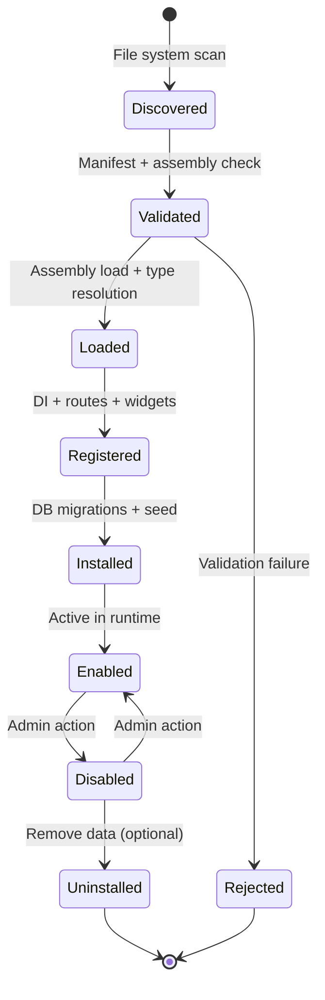

# Commerce Framework — Plugin Architecture (PHASE 0)

**Purpose:** Define the dynamic plugin engine that replaces and extends the existing GateWayFrameWork compile-time banking plugin model for commerce extensibility.

---

## 1. Current State vs Target State

### GateWayFrameWork plugin model (banking — preserved)

| Aspect | Current implementation |
|---|---|
| Registration | Compile-time: `plugins.AddPlugin<Bank1Plugin>()` in `Program.cs` |
| Contract | `IBankingGatewayPlugin` |
| Discovery | None — referenced as project references |
| Lifecycle | ConfigureServices → ConfigureRoutes → Initialize → Shutdown |
| Routing | YARP reverse proxy route merge |
| Capabilities | `BankingPluginCapability` flags |
| Configuration | `Plugins:Bank1:BaseUrl` in appsettings |
| Health | Per-plugin health check calling downstream service |

**This model remains unchanged for banking.** Commerce gets a new, more capable plugin engine.

### Commerce plugin model (target)

| Aspect | Target implementation |
|---|---|
| Registration | Runtime discovery from `Plugins/` directory |
| Contract | `ICommercePlugin` + typed provider interfaces |
| Discovery | File system scan for `Plugin.json` manifests |
| Lifecycle | Discover → Validate → Load → Register → Install → Enable → Disable → Uninstall |
| Routing | MVC area/route registration + API endpoint registration |
| Capabilities | Declared in manifest `SupportedTypes[]` |
| Configuration | Plugin-scoped settings via `ISettingService` |
| Migrations | Plugin-owned `ICommerceMigration` implementations |
| Isolation | Own namespace, services, tables, permissions, localization |

### Commerce plugin model (Phase 18–19 — IMPLEMENTED)

See [PHASE-18-REPORT.md](./PHASE-18-REPORT.md) and [PHASE-19-REPORT.md](./PHASE-19-REPORT.md).

Key implemented components:
- `Commerce.Framework.PluginContracts` — contracts
- `Commerce.Framework.Plugins` — engine
- `Plugins/Payment.Manual/` — reference payment plugin
- `Plugins/Commerce.Test/` — test-only validation plugin
- Admin API `/api/admin/plugins/*` + Angular `/plugins`
- MVC routes `/api/plugins/{systemName}/*` from enabled plugin assemblies
- Plugin settings via `ISettingService`, permissions via dynamic contributor
- Plugin migrations on install, localization from `Localization/*.json`
- Multi-store configuration via `CommercePluginStoreConfiguration`
- **Security:** plugins are trusted code; not sandboxed
- **Angular:** server-driven UI metadata only — no runtime JS from ZIP packages

### Plugin routing (Phase 19)

```
/api/plugins/{systemName}/{route}
```

Plugin controllers are registered through `ApplicationPartManager` only for assemblies in `PluginAssemblyRegistry` (validated, enabled plugins at startup).

---

## 2. Plugin Types

### 2.1 Provider Plugins

Implement a typed provider interface:

| Interface | Purpose | Examples |
|---|---|---|
| `IPaymentProvider` | Payment processing | Manual, ZarinPal, Stripe, PayPal |
| `IShippingProvider` | Shipping rate calculation | FlatRate, WeightBased, ExternalCarrier |
| `ITaxProvider` | Tax calculation | FixedRate, CountryBased, Avalara |
| `ISearchProvider` | Search backend | Database, Elasticsearch, OpenSearch |
| `IMediaStorageProvider` | File storage | Local, S3, AzureBlob, MinIO |
| `IWidgetProvider` | UI widgets | Banner, ProductCarousel, HtmlBlock |
| `IThemeProvider` | Theme packages | Default, MyStore |

### 2.2 Module Plugins

Full feature plugins that register multiple services:

| Example | Capabilities |
|---|---|
| `Marketing.Telegram` | Widgets, scheduled tasks, own tables |
| `Payment.ZarinPal` | Payment provider, settings, migrations, admin pages |
| `Analytics.Google` | Widgets, event handlers, settings |

### 2.3 Widget Plugins

Implement `IWidget` for specific widget zones:

```csharp
public interface IWidget
{
    string SystemName { get; }
    string FriendlyName { get; }
    IReadOnlyList<string> SupportedZones { get; }
    Task<IWidgetModel> PrepareModelAsync(WidgetContext context);
}
```

---

## 3. Plugin Manifest (Plugin.json)

Every plugin ships a manifest at its root:

```json
{
  "SystemName": "Payment.ZarinPal",
  "FriendlyName": "ZarinPal Payment Gateway",
  "Version": "1.0.0",
  "MinFrameworkVersion": "1.0.0",
  "Author": "Behzad",
  "Description": "ZarinPal payment gateway for Iranian market",
  "SupportedTypes": [
    "PaymentProvider"
  ],
  "Dependencies": [],
  "Settings": [
    {
      "Name": "Payment.ZarinPal.MerchantId",
      "Type": "string",
      "DefaultValue": "",
      "IsSecret": false
    },
    {
      "Name": "Payment.ZarinPal.IsSandbox",
      "Type": "boolean",
      "DefaultValue": "true"
    },
    {
      "Name": "Payment.ZarinPal.ApiKey",
      "Type": "string",
      "DefaultValue": "",
      "IsSecret": true
    }
  ],
  "Permissions": [
    "Payment.ZarinPal.Manage"
  ],
  "Migrations": [
    "Commerce.Plugin.Payment.ZarinPal.Migrations.Initial"
  ],
  "Routes": [
    {
      "Area": "Admin",
      "Pattern": "admin/plugins/zarinpal/{action=Index}/{id?}"
    }
  ],
  "Widgets": [],
  "LocalizationResources": "Localization/resources.json"
}
```

### Manifest validation rules

| Rule | Enforcement |
|---|---|
| `SystemName` must be unique | Reject duplicate on discovery |
| `SystemName` format: `{Category}.{Name}` | Regex validation |
| `MinFrameworkVersion` must be ≤ current framework version | Skip with warning if incompatible |
| `Dependencies[]` must reference installed plugins | Topological sort on load |
| Secret settings must never appear in logs | `IsSecret: true` → masked in admin UI and logs |
| Plugin tables must use plugin prefix | Migration validator checks table names |

---

## 4. Plugin Contract

### 4.1 Core plugin interface

```csharp
public interface ICommercePlugin
{
    PluginDescriptor Descriptor { get; }

    void ConfigureServices(PluginServiceContext context);
    void ConfigureRoutes(IEndpointRouteBuilder endpoints);
    void ConfigureWidgets(IWidgetRegistry widgets);
    void ConfigurePermissions(IPermissionRegistry permissions);
    void ConfigureLocalization(ILocalizationRegistry localization);

    Task InstallAsync(PluginInstallContext context, CancellationToken ct = default);
    Task UninstallAsync(CancellationToken ct = default);
    Task EnableAsync(CancellationToken ct = default);
    Task DisableAsync(CancellationToken ct = default);
}
```

### 4.2 Plugin descriptor

```csharp
public sealed record PluginDescriptor(
    string SystemName,
    string FriendlyName,
    Version Version,
    Version MinFrameworkVersion,
    string Author,
    string Description,
    IReadOnlyList<PluginType> SupportedTypes,
    IReadOnlyList<string> Dependencies,
    string AssemblyPath,
    string DirectoryPath);
```

### 4.3 Payment provider interface

```csharp
public interface IPaymentProvider
{
    string SystemName { get; }
    string FriendlyName { get; }
    PaymentMethodType MethodType { get; }

    Task<PaymentResult> CreatePaymentAsync(PaymentRequest request, CancellationToken ct);
    Task<PaymentResult> VerifyPaymentAsync(PaymentVerificationRequest request, CancellationToken ct);
    Task<PaymentResult> CapturePaymentAsync(PaymentCaptureRequest request, CancellationToken ct);
    Task<PaymentResult> RefundPaymentAsync(PaymentRefundRequest request, CancellationToken ct);
    Task<PaymentResult> CancelPaymentAsync(PaymentCancelRequest request, CancellationToken ct);

    Task<bool> CanRePostProcessPaymentAsync(Order order);
    Task<IReadOnlyList<PaymentMethodInfo>> GetPaymentMethodsAsync(int storeId);
}
```

**Critical rule:** Core order system never references ZarinPal, Stripe, or PayPal directly. All payment logic flows through `IPaymentProvider` resolved by system name.

### 4.4 Shipping provider interface

```csharp
public interface IShippingProvider
{
    string SystemName { get; }
    string FriendlyName { get; }

    Task<IReadOnlyList<ShippingOption>> GetShippingOptionsAsync(
        ShippingOptionRequest request, CancellationToken ct);

    Task<decimal> GetFixedRateAsync(int storeId, CancellationToken ct);
}
```

### 4.5 Tax provider interface

```csharp
public interface ITaxProvider
{
    string SystemName { get; }
    string FriendlyName { get; }

    Task<TaxRateResult> GetTaxRateAsync(TaxRateRequest request, CancellationToken ct);
    Task<TaxTotalResult> CalculateTaxAsync(TaxCalculationRequest request, CancellationToken ct);
}
```

---

## 5. Plugin Lifecycle



### Lifecycle operations

| Operation | Trigger | Actions |
|---|---|---|
| **Discover** | Application startup / admin refresh | Scan `Plugins/` directory for `Plugin.json` |
| **Validate** | After discover | Check manifest schema, version, dependencies, assembly integrity |
| **Load** | After validate | `AssemblyLoadContext` load plugin DLL |
| **Register** | After load | Call `ConfigureServices`, register routes, widgets, permissions |
| **Install** | Admin action or setup wizard | Run plugin migrations, seed settings, register permissions |
| **Enable** | Admin action | Activate provider in runtime registry |
| **Disable** | Admin action | Deactivate without removing data |
| **Uninstall** | Admin action | Optional data cleanup, remove migrations record |

### Plugin state persistence

```csharp
public class PluginState  // EF entity
{
    public int Id { get; set; }
    public string SystemName { get; set; }
    public string Version { get; set; }
    public PluginInstallState InstallState { get; set; }  // Installed, Uninstalled
    public bool IsEnabled { get; set; }
    public DateTime InstalledOnUtc { get; set; }
}
```

---

## 6. Plugin Discovery and Loading

### Directory structure

```
Commerce.Host/
├── Plugins/
│   ├── Payment.ZarinPal/
│   │   ├── Plugin.json
│   │   ├── Commerce.Plugin.Payment.ZarinPal.dll
│   │   ├── Views/
│   │   ├── wwwroot/
│   │   └── Localization/
│   ├── Payment.Manual/
│   │   ├── Plugin.json
│   │   └── Commerce.Plugin.Payment.Manual.dll
│   ├── Shipping.FlatRate/
│   ├── Tax.FixedRate/
│   ├── Search.Database/
│   ├── Storage.Local/
│   └── Themes.Default/
```

### Discovery algorithm

```
1. Scan {ContentRoot}/Plugins/*/Plugin.json
2. For each manifest:
   a. Deserialize and validate schema
   b. Check MinFrameworkVersion compatibility
   c. Verify assembly file exists
   d. Check dependency graph (topological sort)
3. Load assemblies in dependency order via collectible AssemblyLoadContext
4. Find types implementing ICommercePlugin
5. Register in PluginRegistry
```

### Assembly isolation

- Each plugin loads in a **collectible `AssemblyLoadContext`**
- Plugin can be unloaded on disable/uninstall (with restrictions)
- Shared types (contracts, core abstractions) loaded in default context
- Plugin cannot reference other plugin assemblies directly — only through contracts

---

## 7. Plugin Registration in DI

```csharp
public static class PluginServiceExtensions
{
    public static IServiceCollection AddCommercePlugins(
        this IServiceCollection services,
        IConfiguration configuration,
        IWebHostEnvironment environment)
    {
        services.AddSingleton<IPluginManager, PluginManager>();
        services.AddSingleton<IPluginDiscovery, FileSystemPluginDiscovery>();

        // Core plugins (always loaded, not dynamic)
        services.AddPaymentProvider<ManualPaymentProvider>();

        // Dynamic plugins discovered at startup
        services.AddHostedService<PluginLoaderHostedService>();

        return services;
    }
}
```

### Provider resolution

```csharp
public class PaymentService : IPaymentService
{
    private readonly IEnumerable<IPaymentProvider> _providers;

    public IPaymentProvider GetProvider(string systemName) =>
        _providers.FirstOrDefault(p => p.SystemName == systemName)
        ?? throw new PaymentProviderNotFoundException(systemName);
}
```

---

## 8. Plugin Isolation Rules

| Rule | Enforcement |
|---|---|
| Own namespace | `Commerce.Plugin.{Category}.{Name}` |
| Own services | Registered via `ConfigureServices` only |
| Own configuration | Plugin-scoped settings: `{SystemName}.{Key}` |
| Own migrations | `ICommerceMigration` with plugin scope |
| Own localization | `Localization/resources.json` in plugin directory |
| Own permissions | Declared in manifest, registered on install |
| Own admin pages | MVC area or Razor Pages in plugin Views/ |
| Own routes | Declared in manifest, registered via `ConfigureRoutes` |
| Own assets | `wwwroot/` served under `/plugins/{systemName}/` |
| Own database tables | Prefixed with plugin name: `ZarinPalTransaction` |
| No cross-plugin references | Architecture tests + assembly load context |
| No core table modification | Plugins use integration contracts only |

---

## 9. Plugin Settings

Settings follow the pattern established by Smartstore and GateWayFrameWork:

| Scope | Key pattern | Example |
|---|---|---|
| Global | `{SystemName}.{Key}` | `Payment.ZarinPal.MerchantId` |
| Store-specific | Same key + StoreId | `Payment.ZarinPal.MerchantId` (store 1) |
| Secret | `IsSecret: true` in manifest | Never logged, encrypted at rest |

```csharp
public interface ISettingService
{
    Task<T> GetSettingAsync<T>(string key, int storeId = 0, T defaultValue = default);
    Task SetSettingAsync<T>(string key, T value, int storeId = 0);
    Task<bool> SettingExistsAsync(string key, int storeId = 0);
}
```

---

## 10. Plugin Widgets

### Widget zone registry

```csharp
public interface IWidgetZoneRegistry
{
    void RegisterZone(string zoneName, string description);
    IReadOnlyList<string> GetAllZones();
}
```

### Standard widget zones

| Zone | Location |
|---|---|
| `home.hero` | Homepage hero banner |
| `home.before-products` | Before product listing |
| `home.after-products` | After product listing |
| `category.before-products` | Category page, before products |
| `category.after-products` | Category page, after products |
| `product.before-description` | Product detail, before description |
| `product.after-description` | Product detail, after description |
| `cart.before-summary` | Cart page, before totals |
| `checkout.before-payment` | Checkout, before payment step |
| `footer` | Site footer |
| `admin.dashboard` | Admin dashboard widgets |

Plugins register widgets without modifying core controllers:

```csharp
public void ConfigureWidgets(IWidgetRegistry widgets)
{
    widgets.RegisterWidget<ZarinPalPaymentWidget>("checkout.before-payment");
}
```

---

## 11. Plugin Migrations

Each plugin can ship migrations:

```csharp
[CommerceMigration("Payment.ZarinPal", "1.0.0", "Initial ZarinPal tables")]
public class ZarinPalInitialMigration : ICommerceMigration
{
    public async Task UpAsync(CommerceDbContext context, CancellationToken ct)
    {
        // Create ZarinPalTransaction table
    }

    public async Task DownAsync(CommerceDbContext context, CancellationToken ct)
    {
        // Drop ZarinPalTransaction table
    }
}
```

Migration engine runs plugin migrations after core migrations, in dependency order. See [MIGRATION-PLAN.md](./MIGRATION-PLAN.md).

---

## 12. Plugin Admin UI

Admin area at `/admin/plugins`:

| Feature | Description |
|---|---|
| Plugin list | All discovered plugins with status (installed/enabled/disabled) |
| Install | Run migrations, seed settings, register permissions |
| Enable/Disable | Toggle without data loss |
| Uninstall | Remove plugin data (with confirmation) |
| Configure | Plugin-specific settings page |
| Upload | Upload plugin ZIP package (future) |

Each plugin can contribute its own admin controller:

```csharp
[Area("Admin")]
[Route("admin/plugins/zarinpal")]
[Authorize(Permission = "Payment.ZarinPal.Manage")]
public class ZarinPalAdminController : Controller
{
    // Plugin-specific admin actions
}
```

---

## 13. Sample Plugin Projects

### Phase 9 — Payment.Manual (first plugin)

```
Commerce.Plugins/Payments/
└── Commerce.Plugin.Payment.Manual/
    ├── Plugin.json
    ├── ManualPaymentProvider.cs      (implements IPaymentProvider)
    ├── ManualPaymentModule.cs        (implements ICommercePlugin)
    └── Views/Admin/Configure.cshtml
```

### Phase 9 — Payment.ZarinPal (second plugin)

```
Commerce.Plugins/Payments/
└── Commerce.Plugin.Payment.ZarinPal/
    ├── Plugin.json
    ├── ZarinPalPaymentProvider.cs
    ├── ZarinPalApiClient.cs
    ├── Migrations/ZarinPalInitialMigration.cs
    ├── Entities/ZarinPalTransaction.cs
    ├── Views/
    ├── wwwroot/
    └── Localization/resources.json
```

---

## 14. Relationship to Banking Plugins

| Aspect | Banking (`IBankingGatewayPlugin`) | Commerce (`ICommercePlugin`) |
|---|---|---|
| Purpose | Route traffic to bank services via YARP | Extend commerce platform capabilities |
| Loading | Compile-time | Runtime dynamic |
| Routing | YARP reverse proxy | MVC routes + API endpoints |
| Coexistence | Both in same solution, separate hosts | `Gateway.Host` for banking, `Commerce.Host` for commerce |

Banking plugins are **not migrated** to the commerce plugin engine. They continue using `IBankingGatewayPlugin` unchanged.

---

## 15. Evolution from GateWayFrameWork Plugin Code

| GateWayFrameWork asset | Commerce evolution |
|---|---|
| `IBankingGatewayPlugin` | `ICommercePlugin` (generalized lifecycle) |
| `BankingGatewayPluginMetadata` | `PluginDescriptor` from manifest |
| `PluginRouteBuilder` | `ConfigureRoutes(IEndpointRouteBuilder)` |
| `PluginRouteRegistry` | `PluginRegistry` with provider resolution |
| `PluginProxyConfigProvider` | Not needed (commerce uses MVC, not YARP) |
| `AddBankPluginHttpClient<T>()` | `AddPluginHttpClient<T>(systemName)` for external APIs |
| `BankingPluginCapability` | `SupportedTypes[]` in manifest |
| Compile-time `AddPlugin<T>()` | Runtime `FileSystemPluginDiscovery` |
| Plugin health checks | Plugin health via `IPluginManager.GetPluginHealth()` |

Patterns preserved: metadata validation, duplicate detection, configuration sections, lifecycle hooks, health reporting.

---

## 16. Architecture Tests for Plugins

| Test | Rule |
|---|---|
| `Plugins_ShouldNotReference_CoreImplementation` | Plugins → Contracts only |
| `Plugins_ShouldNotReference_OtherPlugins` | No direct plugin-to-plugin refs |
| `Plugins_ShouldNotModify_CoreTables` | Migration validator checks table names |
| `Core_ShouldNotReference_AnyPlugin` | Zero plugin references in framework |
| `PluginTables_ShouldBeNamespaced` | All plugin tables start with plugin prefix |
